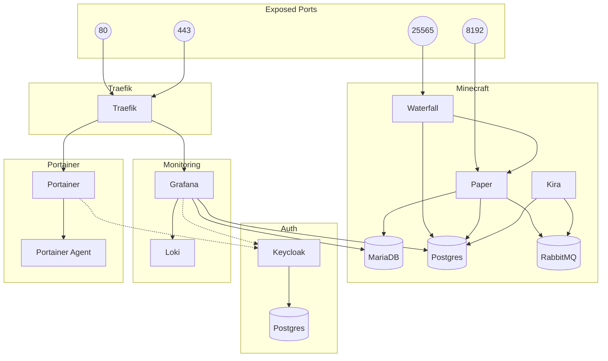

# CivAnsible

## Prerequisites
1. Inventory created
2. Github Settings: environments defined with SSH_KNOWN_HOSTS, SSH_PRIVATE_KEY, SUDO PASSWORD
3. Actions secret defined with SECRETS_YML
4. SINGLE manager node

## Deployable Services

