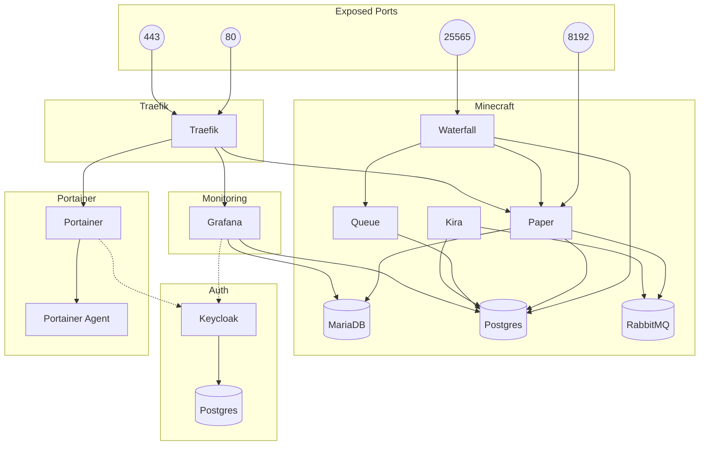

# CivAnsible

## Deployable Services

```mermaid
graph TD;

subgraph Exposed Ports;
  port_http((80));
  port_https((443));
  port_mc((25565));
  port_vote((8192));
end;

subgraph Minecraft;
  mc_waterfall[Waterfall];
  mc_paper[Paper];
  mc_queue[Queue];
  mc_kira[Kira];
  mc_mariadb[(MariaDB)];
  mc_postgres[(Postgres)];
  mc_rabbitmq[(RabbitMQ)];
  
  port_mc-->mc_waterfall;
  port_vote-->mc_paper;
    
  mc_waterfall-->mc_paper;
  mc_waterfall-->mc_queue;
  mc_waterfall-->mc_postgres;
  mc_paper-->mc_postgres;
  mc_paper-->mc_mariadb;
  mc_paper-->mc_rabbitmq;
  mc_queue-->mc_postgres;
  mc_kira-->mc_postgres;
  mc_kira-->mc_rabbitmq;
end;

subgraph Auth;
  auth_keycloak[Keycloak];
  auth_postgres[(Postgres)];
  
  auth_keycloak-->auth_postgres;
end;

subgraph Monitoring;
  mon_grafana[Grafana];
  
  mon_grafana-->mc_postgres;
  mon_grafana-->mc_mariadb;
  mon_grafana-.->auth_keycloak;
end;

subgraph Portainer;
  por_portainer[Portainer];
  por_agent[Portainer Agent];
  
  por_portainer-->por_agent;
  por_portainer-.->auth_keycloak;
end;

subgraph Traefik;
  tfk_traefik[Traefik];
  
  port_http-->tfk_traefik;
  port_https-->tfk_traefik;
  
  tfk_traefik-->mon_grafana;
  tfk_traefik-->mc_paper;
  tfk_traefik-->por_portainer;
end;
```