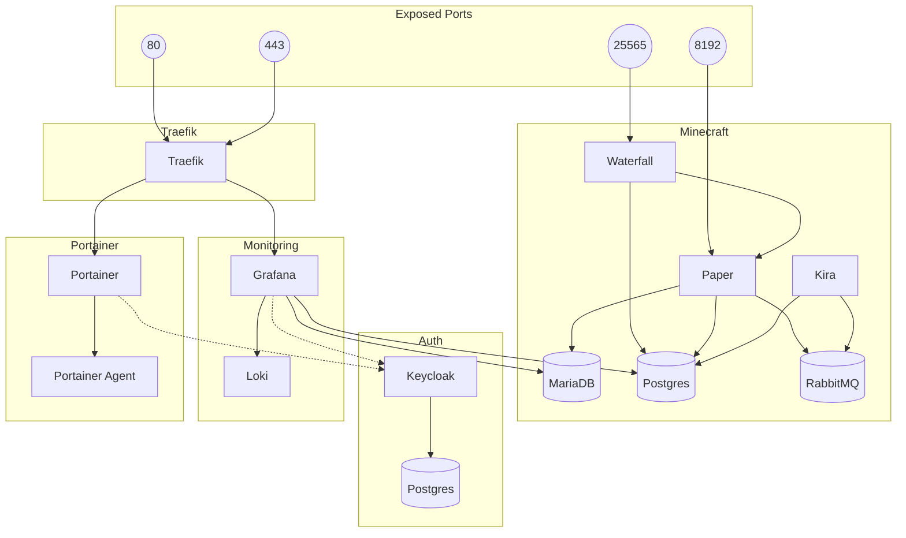

# Civ Deployment

This project is a hybrid Gradle/pyinfra deployment project that provisions and deploys services to a server.

Vendored plugins are located in `src/` because Gradle uses them to build the final plugin directories in `build/`.
Configs are located in `files/` because deployment scripts copy them directly to the target hosts.

## Prerequisites

1. Create a user on the server named `actions` with sudo privileges.
2. Create environments in GitHub settings with the following environment secrets:
   - `SSH_KNOWN_HOSTS`
   - `SSH_PRIVATE_KEY`
   - `SUDO_PASSWORD`
3. Create a repo-scoped secret named `SECRETS_YML` with the contents of `variables/secrets.yml`.
4. Create a pyinfra inventory named after the environment in `inventories/`.

## Usage

1. Build dependencies with `gradle :deployment:build`.
2. Install deploy tooling with `pip install pyinfra PyYAML`.
3. Run a deploy with `pyinfra inventories/<inventory>.py deploys/<deploy>.py --sudo --sudo-password '<password>'`.

## TODOs

- Private Config
- Mount backups location and configure params, setup

## Provisioned Layout

```
/
└── opt/
    ├── backup-and-restart.sh
    └── stacks/
        └── <stack>/
            ├── <stack>.yml
            └── ...<service-data>
```

## Deployable Services


