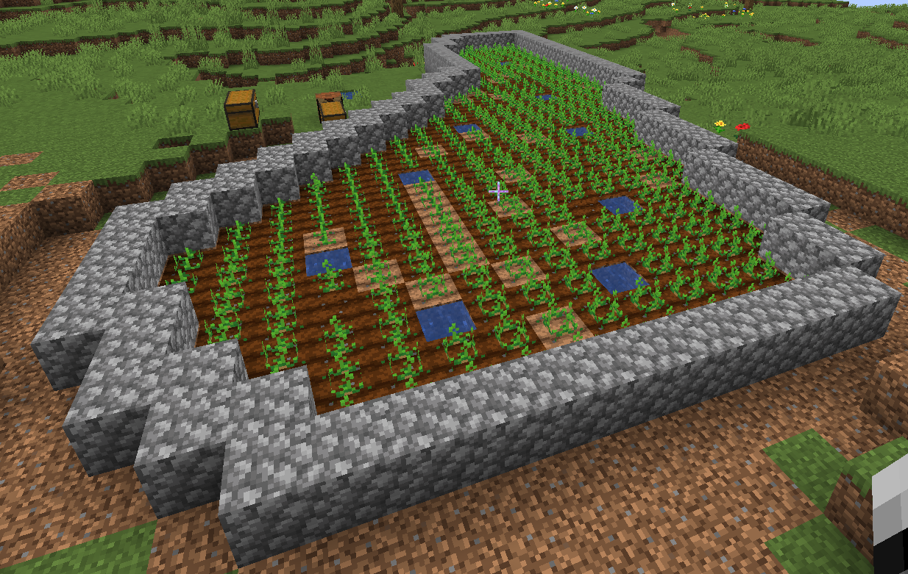
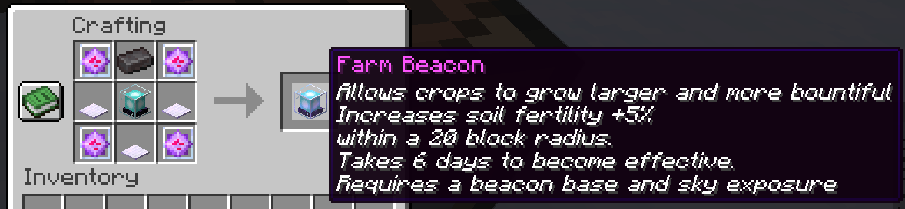

# CivMini
Civmini is the experimental branch server of CivMC. Here new features and mechanics are first trialed, tested and balanced to eventually bring them to the main server.
Because of this, **help from admins for loss of items due to bugs is not given**. And all players are encouraged to switch over to the main server. 
CivMini is also used as a queue for players wishing to join the main server when it is full. Either joining the main server (Play.CivMC.Net) while it is full or using the **/queue main** command while on the server.

There are many things changed or different on CivMini Below is a detailed list of these changes.

## Minor changes
- **The use of bots is not allowed on CivMini**, all actions have to be done by a real player. Automated farming, mining or other automation of gameplay elements that gives an advantage through use of macros or other non human input can result in a ban. Small exceptions exist such as holding down a button or sprint jumping.
- **Reinforcement Decay doubles every 6 weeks** instead of every 2 months and **localised decay is changed to a 384 blocks** range instead of 512 blocks.
- **Reinforcement strength is lowered by 10-20%** on CivMini.

| Material          | CivMC | CivMini |
| ----------------- | ----- |:-------:|
| Stone             | 50    |   45    |
| Iron              | 300   |   250   |
| Diamond           | 2000  |  1700   |
| Netherbrick       | 50    |   45    |
| Gold              | 300   |   250   |
| Gilded Blackstone | 2000  |  1700   |

- On CivMC a 100 block exclusion zone near the world border cannot be reinforced. On Civmini blocks can be reinforced near the world border, but in a **60 block range from the world border reinforcements do not refresh**. This means that any reinforcements placed will decay no matter what.
- Bastions are 15% weaker in CivMini.
- CivMini does not have a kira relay. Not for global chat or personal groups. Creating one using bots is also not allowed. Commands can thus not be done through the kira bot via discord like in CivMC.
- Localchat range has been reduced to 600 blocks on Civmini due to the map being 20% the size of CivMC with a 4500 block radius.
- Iron ore veins have had their yield doubled compared to CivMC, making them more valuable/useful.
- Brewery is disabled.
- Evenmorefish plugin is disabled.

## Farming on CivMini
Farming on CivMC is completely overhauled, crops are no longer tied to specific biomes. Instead each crops has been assigned an ideal set of 2 parameters, humidity and temperature. And each biome has been assigned a base of these 2 parameters.
3 noise maps are overlaid on the map that add variety from one block to another. one for each 2 parameters and a 3rd called fertility which determines yield of the crop. 
All can be measured with shift right clicking with a set of tools. A lightning rod for humidity, a clock for temperature and a brush for fertility. This last one is most important to finding a good farm spot.

A more indepth tutorial of finding a good farm spot is given below.
### Small changes

- All crops and saplings with the exception of mushrooms and nether growables will require direct sunlight to grow. The greenhouse feature of glowstone is disabled. stacked farms are thus not possible. 
- Wheat grows everywhere, this makes it possible for every place to obtain food and contribute a small amount to xp production. Wheat is used in every xp recipe. 
- All saplings grow in all biomes but only drop saplings when in a growth zone like other crops. 
 
### Finding a good farm spot
To find a good farm spot start by crafting a brush. Then use that brush to shift right click on the ground. This will display a chat message with that spot's fertility. The fertility noise map is gradual and "blobby" This means that to find a good growth zone all one has to do is follow the curve. Click around and find out which direction has a higher fertility, then continue on in that direction. This would looks something like this in your chat: 
Once you find a high fertility zone use the /rb command to see which crops match the local humidity and temperature values enough to be growable there in high yields. Then follow the outline of the high fertility zone with the brush and mark it. The inside of this marking is your farm plot ready for plowing!.
Once done correctly you'll have a farm looking a little like this: 

This potato farm for example outputs about a double chest of potatos every harvest. So you don't need a big plot for big gains!

### Harvesting
All Crops have to be harvested manually to get the increased yield. Automated farms such as by redstone machines will not have the increased yield. Indeed even crops such as cactus, bamboo or kelp have to be harvested by hand.
Saplings function a little different, leaves will decay into high amounts of saplings if in the correct growth zone for that tree. but the tree will still have to be cut down by hand. 

### Farm beacon
A farm beacon is a late game boost to your farms, one farm beacon (unstackable effect) gives a 5% fertility bonus in a 20 block radius around it. This could mean up to 3x the orginial yields. Meaning you have to harvest less often for more yield.
A farm beacon can be crafted with 3 meteoric iron ingots like so: 
