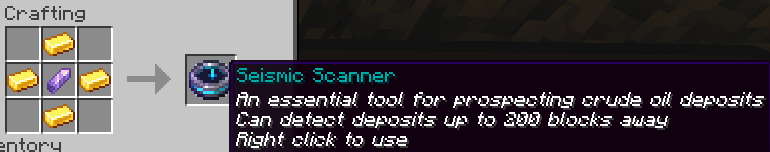
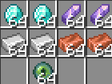
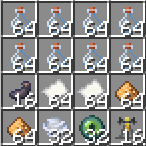
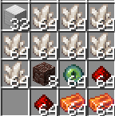
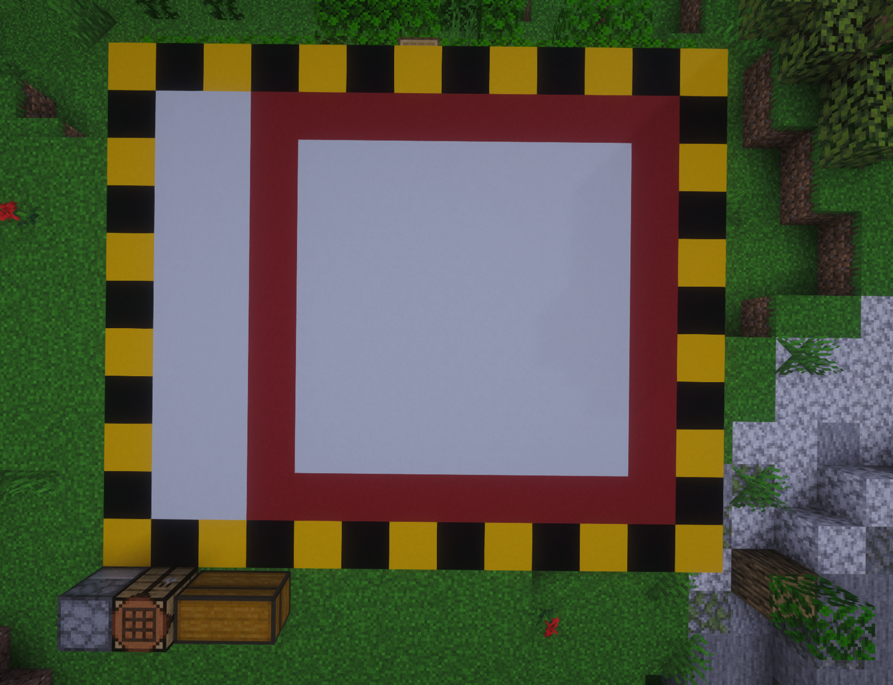
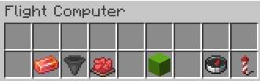
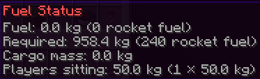
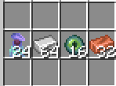

# Zorweth
Zorweth is a new frontier for CivMC, a foreign planet with new land to colonize and new resources to exploit. The planet largely covered in a low-oxygen zone, making exploration and travel a tough endeavor.

Zorweth is sharded from the main world, meaning it runs alongside on the same hardware. This improves performance immensely but practically makes it a separate server. To make sure this does not impact players, the two servers communicate with each other and share information. Things such as namelayer groups transfer over, including chat messages. Thus allowing groups to converse even when on different planets. 

## Unique Resources
Zorweth has several unique resources only found on the planet. These would be important export products to the main world. However, all of them exist outside of habitable zones, making them difficult to extract.

### Salt
Salt is a new unique resource found by digging white concrete powder in the salt flats regions. These places are extremely low in oxygen and thus require advanced oxygen equipment to stay in.

Salt is used to:
*  Refill oxygen tanks.
*  Create the oxygen rebreather.
*  Produce the elite cauldron XP recipe.
*  Increase ore gains in the elite ore smelter.

The following rates apply for each ore smelter factory when a salt catalyst is used:

|   Ore   |          Input          |   Output Basic   | Output Advanced  |   Output Elite   |
|:-------:|:-----------------------:|:----------------:|:----------------:|:----------------:|
| Copper  | 128 Raw Copper, 16 Salt | 24 Copper blocks | 28 Copper blocks | 30 Copper blocks |
|  Iron   |  48 Raw Iron, 16 Salt   |  80 iron Ingots  |  96 iron Ingots  | 104 iron Ingots  |
| Diamond |     16 Ore, 16 Salt     |   52 Diamonds    |   60 Diamonds    |   64 Diamonds    |

### Aluminium
Aluminium is a common mineable that spawns as bauxite like any ore through hiddenore, except it is only found outside the habitable zones. Mining consumes a lot of oxygen, making the proper preparations are thus necessary to survive.

After mining, the bauxite is refined in any of the ore smelter factories for the following rates, where input is bauxite and output is aluminium ingots:
| Factory              | Input | Output |
| -------------------- |:-----:|:------:|
| Basic ore smelter    |  16   |   16   |
| Advanced ore smelter |  16   |   20   |
| Elite ore smelter    |  16   |   22   |

Aluminium is used to:
* Create and repair oxygen tanks.
* Reinforce blocks for 1000 health. 
* Create armor repair kits.

Armor repair kits are used to repair any piece of armor. Each one applied repairs 5% less than before, going from 20% to 15% to 10% to 5%. Applying a repair kit requires no XP, making them ideal for quick field repair.
Armor repair kits are made in the Space Chemistry Factory with 4 Phantom membranes and 8 aluminium ingots. This makes 1 repair kit. 

### Meteoric Iron
Meteoric iron veins spawn roughly twice per day on Zorweth. But only underneath the most extreme environment of the basalt delta. Extreme precaution and preparation is required to mine in this place. 

## Unique Mobs and Drops
- Unique wither skeletons spawn within the basalt delta biome. This mob has a chance to drop totem fragments and/or shards. The fragments can be combined into shards, shards can be combined into a totem of undying.
- Phantoms named "Vultures" spawn in any of the end biomes, these mobs drop their normal phantom membrane, which can be used in several recipes having to do with oxygen. 
- Stronger and taller enderman have a chance to spawn, same as normal enderman but less.
- All creakings have been scaled up.
- Large endermites named "Zorslug" have a chance to spawn in the End_barrens biome. These drop ender pearls. 
### Small Differences With Main
Several changes were made beyond the obvious that make Zorweth unique from the main planet.
*  Meteoric iron does not spawn around portals.
*  Cherry & pale oak wood grow at an increased rate because of the biomes being present.
*  Iron ore spawns at increased rates on Zorweth.
*  Redstone ore spawns at decreased rates on Zorweth.
*  Diamond veins yield less diamonds on Zorweth.
*  Ancient debri spawns at increased rates in Zorweth nether.
*  Glowstone spawns at decreased rates in Zorweth nether.
*  Cobwebs from leaves in swamps & mangrove biomes drop at 3x the rate on Zorweth.

Bleezes do not spawn on Zorweth. This means that no windcharges can be obtained on the planet. Thus some things are locked off until main finishes the research and travel is unlocked between the 2 planets.

Kira relays on zorweth are sperated from main. This means a seperate relay is required even when on the same group. Use the following command in discord to make a Zorweth relay:
`!kira createrelayhere zorweth <group>`
## Getting To Zorweth
Traveling to Zorweth is not an easy feat, several steps are required before one can fly among the stars and reach this strange new land.

### Pioneer
For the first week (from 26th of June to the 3rd of July), any player can run the `/pioneer` command. This will wipe the player's inventory and randomspawn them on Zorweth in a habitable zone.
**WARNING!**
Players who do this will be stuck on Zorweth until players from the main planet are able to travel to Zorweth. This may take a very long time... 

### Oil
The first step to space travel is finding a fuel source. OIL! has been added as resource nodes randomly spread across both worlds. Players will have to find, extract and refine it to produce rocket fuel. 

#### Finding & Extracting Oil
To find oil, one first has to make a seismic scanner with 4 gold ingots and an amethyst shard.

When right-clicked, a seismic scanner scans a radius of 200 blocks around the player for any Oil deposits. Once within 100 blocks, it will show a different message, and while within an oil deposit (which has a radius of 20 blocks), it will say it is an ideal spot.

Extracting the oil is done by building a crude oil factory in this location.

|                       Construction cost                        | List    |
|:--------------------------------------------------------------:| --- |
|  | <li>128 Diamond</li><li>128 Amethyst Shard</li><li>128 Iron Ingot</li><li>128 Copper Ingot</li><li>64 Player Essence</li>    |

Oil deposits have varying yields per hour. The following table allows you to tell the grade of the deposit:

| Deposit Grade | Run time | Output per hour |
| ------------- |:---------------:|:---------------:|
| Low           |   15 minutes    |  64 crude oil   |
| Medium        |   12 minutes    |  80 crude oil   |
| High          |   10 minutes    |  96 crude oil   |
| Very High     |    7.5 minutes    |  128 crude oil  |

The extract oil recipe is not sped up by a factory upgrade.

#### Refining Oil Into Fuel
After finding and extracting oil, construct a "Space Chemistry Factory" using the following resources:

| Construction cost                                            | List: |
| ------------------------------------------------------------ | ----- |
|  | <li>512 Bottles</li><li>128 Paper</li><li>128 Glowstone</li><li>32 Windcharge</li><li>32 Player Essence</li><li>16 Ink sac</li><li>16 brewing stand</li> |

Then run the "Refine Crude Oil" recipe using 64 crude oil and 128 glowstone. This outputs 8 rocket fuel (64 kg). 

## Research
Before travel between Zorweth and Main via rocket is unlocked, 2 research projects have to be completed in sequence on Main.
Within the Space Chemistry Factory, 2 recipes correspond to this research. Running and completing the recipes adds to the global progress of the research project. 

The Research Phase 1 recipe requires the following resources:
* 4 Gold Ingots.
* 8 Amethyst Shards.
* 5 Emeralds.
* 16 Redstone Dust
* 2 Iron Ingots
* 4 Diamonds

This recipe must be run 30,000 times globally to unlock Phase 2.

Research Phase 2 requires the following resources:
* 15 Gold Ingots
* 5 Iron Ingots
* 5 Emeralds
* 64 Redstone Dust
* 3 Ink Sacs
* 64 Paper
* 12 Amethyst Shards
* 6 kg Rocket fuel

This recipe must be run 20,000 times. Upon completion, space travel is unlocked and rockets will be able to launch to and from Zorweth. Each run of the recipes also outputs a piece of paper called "Research Notes" with the player's name on it, as proof of your contribution. 

## Rockets
The first step to making a rocket is building the Space Factory, this requires the following resources:

| Construction Cost | List |
| -------- | -------- |
| | <li> 512 Nether Quartz</li><li>128 Redstone Dust</li><li>128 Rocket Fuel</li><li>64 Player Essence</li><li>32 Iron Blocks</li><li>8 Ancient Debris</li>     |
### Constructing the Rocket

Before building the Space Factory, be aware that the orientation matters! The rocket is built at the back of the factory, offset towards the right. Make sure to study the image below.

 13 Length x 11 Width

This image shows the space required to build the rocket (the floor can be any block. Blocks used in the image are for clarity). The black and yellow outline represents the total space required, which needs to be empty. As seen, this is at the back of the Space Factory.
The red outlines is where the actual rocket is built by the factory, for aesthetic purposes, this would be taken as the center point.

Once the space is cleared, run the "Build Rocket" recipe, using the following resources:
* 256 Clay
* 96 Resin Clumps
* 64 Iron Blocks
* 20 Ancient Debris
* 20 Pistons
* 32 Advanced Mechanical Component
  * Made in the Space Chemistry Factory per 8 with the following resources:
  * 32 Redstone Comparators
  * 256 Nether Quartz
  * 256 blocks of copper
  * 512 Redstone Dust

### Fueling The Rocket

Once the rocket is built, climb the ladder and head inside. Here you will find 22 single chests to store your cargo. Climb further to the top of the rocket and find a dispenser, this is the flight computer interface. Right click to open the interface.

Click on the Resin Brick icon to add fuel from your hand to the rocket. You can see how much fuel is already in the rocket and how much is required when hovering over the dye.

The required fuel ratio is 7.39 (e^2) to Zorweth and 3.32 (e^1.2) back - this means you need 7.39 kg of fuel to bring 1 kg (one stack) of items from main to Zorweth.

The exact formula used for the fuel cost calculation is the Tsiolkovsky equation.
Reaching Zorweth requires 10,000 m/s ∆v, and returning to main needs 6,000 m/s ∆v. The rocket has an exhaust velocity of 5,000 m/s.
The rocket's own mass is 200 kg, players are 50 kg each and a stack of items is 1 kg (compacted items have increased mass).

Each rocket fuel item adds 4 kg of fuel. If too much is added, you are able to take fuel back out of the rocket.

Each rocket has 6 uses from the moment it is built, which is 3 flights there and back.

> [!NOTE]
> Rocket fuel always weighs 4 kg, no matter whether you put it in a chest or into the rocket as fuel!

### Launching The Rocket
After loading up your rocket with fuel, click on the compass and write in the desired coordinates for where you would like to land, either on Zorweth or, in case of a return journey, on Main. 
Zorweth is centered around X: 0 Z: -20000 and has a radius of 7k blocks. Keep this in mind when selecting your coordinates.
Once this is done, run a final check, sit down on one of the seats (right click on the slab), then hit launch and confirm. You and everything onboard are transported across space and server and planted safely at the input destination.
Unless you entered a set of coordinates within a hostile bastion field. If so, your rocket was deflected and landed nearby outside of the bastion field.

#### Launch Requirements

Ensure the 13x11 area of the rocket stays clear of blocks: if anything on the rocket was broken or if something that was air is no longer air, it will block the rocket from launching. Blocks broken on the rocket can be replaced to repair it, as long as it's exactly the same as it was before. 
The only thing not repairable is the Flight Computer. Once this block is broken, the rocket ceases to function completely. The Flight Computer for this reason, does get a free, mature diamond reinforcement on the group the Space Factory is reinforced to. In addition, all chests receive mature stone reinforcements, while structural blocks are unreinforced.

> [!CAUTION]
> If the flight computer reinforcement is not diamond, the entire rocket will transfer unreinforced. You may change the chest reinforcement (such as to a different group), but on the next flight they will reset to stone on their original group. **Any other reinforcements will be destroyed.**

## Surviving on Zorweth
Zorweth is covered in hazardous, low-oxygen biomes. Surviving requires being properly prepared. Your oxygen level and depletion rate can be seen on the side of the screen in the scoreboard. The base amount of oxygen is 1000 units. Various oxygen items can be crafted to either increase this capacity or to refill it. 

### Oxygen Mechanics

Each of the various hazardous zones was assigned separate biomes, these biomes have been assigned different oxygen drain rates. Different kinds of activites have different oxygen drain rates. Oxygen consumption while walking and idling is greatly reduced compared to other activities such as sprinting or mining.

In any other biome players are safe and oxygen slowly refills 6 oxygen units per second, or 12 when idle.

### Oxygen gear

If your oxygen equipment is not compatible with a particular activity, it will cost double oxygen. Below is a table showing oxygen equipment and activity compatbility. 

| Oxygen gear          | Idle | Walking | Sprinting | Regen | Boating | Mining | Combat |
| -------------------- | ---: | ------: | --------: | ----: | ------: | -----: | -----: |
| None            |    ✅ |       ✅ |                ❌ |     ❌ |       ❌ |      ❌ |      ❌ |
| Basic Oxygen Bladder |    ✅ |       ✅ |               ✅ |     ❌ |       ✅ |      ❌ |      ❌ |
| Oxygen Rebreather    |    ✅ |       ✅ |              ✅ |     ✅ |       ✅ |      ✅ |      ❌ |
| Oxygen Suit          |    ✅ |       ✅ |             ✅ |     ✅ |       ✅ |      ✅ |   ✅ 

#### Basic Oxygen
There are various ways to produce oxygen. The simplest and worst way is to craft together a pitcher plant, coal and a bottle.
This gives you a bottle of crude oxygen, which can be consumed for 90 oxygen units. These bottles stack up to 16.
Pitcher plants are scattered throughout most of the habitable biomes.

BreweryX oxygen in the next step in progression. A single 5-star bottle grants 2200 oxygen units on consumption. To make brewery oxygen you need redstone and ice. Below is the complete process to produce oxygen:
1. Turn 1 redstone torch into 3 electricity.
2. Combine 1 electricity and 1 ice into 3 hydrogen twice, for a total of 6 hydrogen.
3. Combine 2 hydrogen into 3 helium twice, for a total of 6 helium.
4. Combine 3 helium into 3 carbon.
5. Combine 1 carbon and 1 helium to get 3 oxygen.

Brewery oxygen is good enough for basic activities, like traveling or small amounts of mining within the hazardous zones. To last longer, carry this with an oxygen bladder. This equipment increases a player's max oxygen capacity to 4000 units and auto-consumes oxygen consumables when a player's oxygen units go below 1000. It must be worn on the head to use.
To create an oxygen bladder, combine the following ingredients in any order:
* 1 Stick
* 1 String 
* 1 Feather
* 1 Iron nugget
#### Advanced Oxygen
Basic oxygen and the bladder can only take you so far. To thrive on Zorweth, more advanced equipment is required. Start by making an oxygen factory with the following resources:
    
|                      Construction cost                      | List |
|:-----------------------------------------------------------:|:----:|
|  | <li> 64 Iron Ingots</li><li> 32 Copper Ingots</li><li> 24 Pitcher Plants</li><li> 16 Player Essence</li>     |

The next step for any player on Zorweth, would be the oxygen rebreather. In practice it is an upgrade to the oxygen bladder. The oxygen rebreather increases a player's max oxygen capacity to 30,000 with the added bonus of reducing oxygen consumption while mining and regenerating health.
The oxygen rebreather can be made in the Oxygen Factory with the following resources:
* 64 Salt.
* 32 Redstone blocks.
* 16 Aluminum.
* 1 Oxygen bladder.

The Oxygen Factory also contains recipes to make bigger oxygen consumables. The first of these is the basic oxygen tank. A basic oxygen tank supplies 8000 oxygen units on consumption. Making one of these requires: 
* 64 Coal
* 12 Diamonds
* 8 Aluminum ingots

Once made, it's still empty. To fill it up, run the "Refill basic oxygen tank" recipe, which needs:
- 1 Empty basic oxygen tank
- 4 Salt
- 8 minutes and 32 seconds. Factory upgrades do not increase the speed.

Once consumed, an empty tank is returned. Refilling oxygen tanks can only be done in habitable zones. The Oxygen Factory should for this reason always be built in a habitable zone. Oxygen tanks cannot be manually consumed, an oxygen rebreather or better is required to use them.
Oxygen tanks have a 10% chance of breaking on use. To repair them, run the repair recipe in the Oxygen Factory. This costs either 2 Aluminum for a basic tank, or 4 for an advanced one.

The advanced oxygen tank provides 34,000 oxygen units and can be made or refilled in the same way. It requires the following resources to be made:
* 32 Wind Charges
* 32 Aluminum
* 12 Diamonds

To refill the advanced oxygen tank, run the "Refill advanced oxygen tank" recipe, which needs: 
- 1 Empty advanced oxygen tank
- 12 Salt
- 1 Oxygen filter
- 17 minutes and 4 seconds. Factory upgrades do not increase the speed.

Oxygen filters are also made in the Oxygen factory, and to make 4, it costs:
- 1 Phantom membrane 
- 1 Wind charge

The oxygen suit is the final upgrade to the oxygen rebreather. It halves oxygen consumption during combat and has a capacity of 85,000 oxygen units. It requires the following resources to be made:
* 56 Crude oil
* 32 Redstone blocks.
* 24 Aluminum ingots.
* 12 Oxygen filters.
* 2 Netherite ingots.
* 1 Oxygen rebreather

Oxygen tanks are only consumed up to 35,000 units filled in your suit. To reach full capacity either wait in a habitable biome to fill it up slowly, or consume crude/brewery oxygen.

### Habitable zones
There are several zones on Zorweth that are safe for players and require no oxygen to survive in. These habitable zones consist of the usual overworld biomes, closed off either by crater ridges or by being large underground caves. 

Crater zones, are above ground and surrounded by large mountains, protecting it from the outside and keeping oxygen inside. These biomes extend from sky limit to bedrock. Making them ideal for large settlements, farming and early mining.

Habitable caves are 3D biomes, beyond the walls of the cave in any direction would not be habitable and does require oxygen. All caves are connected to each other by way of habitable passageways, allowing early travel and eventual safe transportation routes. If everyone plays nice...
Some biomes are almost exclusive to these caves.

Habitable zones are the only places where crops can be grown, with exception of Chorus fruit and pale oak trees. In addition, until main lands rockets, all crops and trees grow twice as fast as usual.
