# An Introduction to CivMC

## What is Civ?
Welcome to CivMC! This is the latest mainline server in the Civ genre, which has over a decade of storied history. This is a very fun server, but there is a lot to learn and unpack to make your experience here as meaningful as possible. Civ is truly one of the most immersive games that exist due to its unique community, plugins, alliances, wars, etc that all contribute to the dynamic of the server.

Besides stuff like hacking, harassment based on out of game factors, and exploiting, all justice on Civ is carried out by the players which makes the game so unique. You can raid and grief and not get banned, but do not let that fool you into thinking you can get away with it! There are many competent nations with developed infrastructure and players to bring you to justice if you do decide to go down that route.

## Getting oriented
If you haven’t already you can join the **official CivMC Discord** server with this link: https://discord.gg/HkD79GfmQQ

In order to get access to all of the channels you need to join the server at the IP **play.civmc.net** and run the command **/discordauth**, which will give you a code for you to use to verify in the Discord server. The Discord is where a bulk of the discussions, trading, feedback, and community support takes place so it is especially important for you to join it!

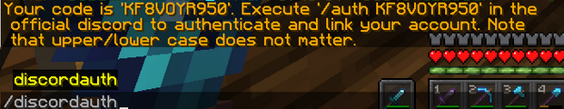
*Output of /discordauth. Which is then run at the civmc discord server.*

### Reddit 
https://www.reddit.com/r/CivMC/
The subreddit is the other place where most of the discussion about the server happens, except it’s mostly official announcements/declarations, maps, polls, and anything else in between.
### Player Wiki 
https://civwiki.org/wiki/Main_Page 
Here you can read up on CivMC’s 2 year history as well as the rest of the Civ genre! Reading about past servers, especially CivClassic, can help you understand the community better. You can read up on the histories of past wars, nations, and players, which have all shaped what CivMC is today.
### World Map
https://map.civinfo.net/
This is a player created and maintained map of the world. It includes many layers of information, but is mainly used by players for the political map. This map shows you what land is currently "Claimed" by nations on the server. This layer is updated about every month and may not be 100% accurate.

## Basic Mechanics
Civ is driven by its complex plugins which allow for player-enforced justice and protection. Many times these plugins are combined together to legitimize the power of players and groups.

### [NameLayer](./plugins/essential/namelayer)
This is the ultimate group management plugin (Imagine discord, but for minecraft !!).

Namelayer allows you to create different groups with a name of your choosing. You can add/remove/promote/demote different players on this group and depending on their level of permission they can do the same, access reinforcements (called bypass, allowing others to break your reinforced blocks instantly) and build things that you can also access as the owner.

Here are the various commands relevant to Namelayer:

**/nl**: View a general overview of all of the Namelayer groups you are in. You can do anything above that I mentioned via a GUI. Recommended for new players. 
**/nlcg [group name]**: Create a group with a specified group name. If it’s taken already it will tell you. 
**/nlip [group name] [player] [rank]**: Invite a player to a specific group and rank. You can leave rank blank for the default permission level, you can also do MODS to allow them to bypass your reinforcements, and also ADMINS and OWNER. 
**/nlrm [group name] [player]**: Maybe the person you invited wasn’t so trusty after all! Quickly remove them from a specific group with this command.

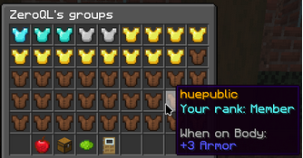
*Pictured: GUI of the /nl command*

### [Citadel](./plugins/essential/citadel)
Citadel may be the most important plugin to the Civ genre. Citadel allows you to spend various materials (stone, iron, diamonds) to reinforce all types of blocks. This allows you to fortify your city and valuables from raiders and griefers.

The materials required for reinforcing and their respective health are listed in the table below. These can also be checked by running the command **/reinforcements** in game.

| Reinforcement Material | Reinforcement Material (Nether) | Breaks |
|:----------------------:|:-------------------------------:|:------:|
|   Stone (NOT Cobble)   |          Nether Brick           |   50   |
|          Iron          |              Gold               |  300   |
|        Diamond         |        Gilded Blackstone        |  2000  |

To reinforce your build, you can use any of the following commands:

**/ctr [optional group]**: Holding a reinforcement material, type this command then start left clicking blocks around you to reinforce. The first parameter is the Namelayer group which you want to reinforce to, you can leave it blank if you just want to reinforce your personal group. 

**/ctf [optional group]**: Holding a reinforcement material, type this command. You can now start placing blocks to automatically reinforce them.

**/cti**: Running **/cti** allows you to see information about different block reinforcements by left clicking on them.

Reinforcing blocks essentially adds a health bar to them, with every block break dealing 1 hp of damage (or more in case the player hasn’t logged in in 2 months).
In simple terms, in order to break a diamond reinforced block, you would have to break it 2000 times !!

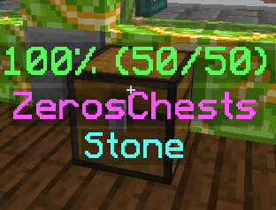
*Pictured: an example output of a block with /cti enabled*

### [Bastions](./plugins/unique/bastions)
Citadel can help enemies from breaking your stuff, but it can’t prevent them from placing grief! Even worse, they might use Citadel against you to place reinforced grief on your builds or farms. This is where Bastion comes into play.

**A bastion** either refers to a city bastion or vault bastion. Both of these bastions prevent enemies from reinforcing blocks, placing water or lava and boats. However these bastion types both serve drastically different purposes.

**A city bastion** covers a 101x101 area and is like its name, meant to protect your city or other large areas of land that need extra protection (maybe a farm, or rail).

**A vault bastion** covers a 21x21 area and does everything a city bastion does, with the addition of preventing enemy block placement and blocking pearls. These are used for areas that warrant the utmost protection, especially large player made prisons called vaults. If you want to learn more about vaults, which is probably the coolest thing that exists on Civ, you can read the player Wiki article on it here: https://civwiki.org/wiki/Vault

### [JukeAlert](./plugins/unique/jukealert)
Don’t think you can raid and get away with it! There exists different blocks called “snitches” in the game that relay all sorts of information to the people in its group, Just like a cctv!

There are 2 types of snitches:

**Noteblock** - covers a 11 radius cube from the block, informs players based on the people entering or exiting the snitch field.

**Jukebox** - covers a 11 radius cube from the block, does everything Noteblock does PLUS it logs all player activity like breaking blocks, placing blocks, opening chests, etc.

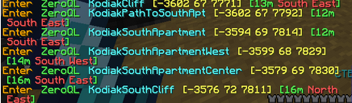
*Pictured: example messages of players hitting a snitch*

Because of the smart ways people utilize snitches, raiding and not getting caught is virtually impossible. If you are a player with that playstyle, be wary. You might be able to escape justice for a few days but you will always get caught, no matter what. The best, most elusive pvpers on this server with infinitely more knowledge than you have gotten will get you eventually.

To place a snitch, place down a noteblock or a jukebox and reinforce it to a Namelayer. 
In the case of jukeboxes. Running the command **/ja** in front of it will show the logs of everything that has happened in its radius.

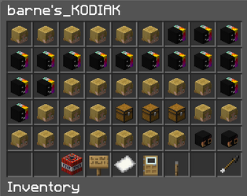

*Pictured: GUI output of /ja. Listing all logs within the snitch Range.*

### [ExilePearl](./plugins/essential/exilepearl)

You may be wondering how players can enforce their justice once they catch you stealing their loot or griefing their builds! ExilePearl is a mechanic that allows people to banish you to the nether once they kill you, and you are unable to escape the nether until you are freed.

By killing someone with an ender pearl in your hotbar, you can bind that person to the pearl like a Pokemon. The person who has your pearl is the only person that can free you. All pearl locations are public information, which you can see with /ep locate. Don’t think you can just get a friend to go and free you though, many times people put these pearls in the middle of “vaults”. Giant Obsidian structures that take IRL days and weeks to break with an experienced attacking force.

Don’t be too worried, most of the time pearls are not permanent and the person who killed you will free you eventually. If you do get pearled, say sorry for what you did and **do not** antagonize the person who killed you. Remember, actions will always have consequences. 

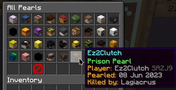
*Pictured: a list of all pearled players using the **/ep showall** command. (notice the year).*

### [Factories](./plugins/unique/factorymod)
Factories are machines that allow you to mass produce items and blocks in bulk. Thereby significantly reducing costs of crafting items. Almost every block that can be crafted has a recipe that can be used with factories, from tools to fences and even ores.

A factory consists of a chest, crafting table and a furnace kept side by side. And requires charcoal specifically to run. Most nations usually provide all the basic factories.

|                  Carpentry Factory GUI                  |                  Basic Factory Setup                  |                      A factory room                       |
|:-------------------------------------------------------:|:-----------------------------------------------------:|:---------------------------------------------------------:|
| 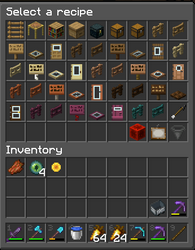                     | 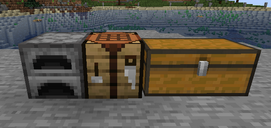                       | 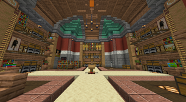                   |

**To use a factory, you follow three simple steps:**
1. Place all the required items into the chest.
2. Left click the crafting table with the tick to open a GUI, and select the recipe to run.
3. Add charcoal to the furnace and left click the chest with the stick.

Almost Every block that can be crafted using a crafting table has a factory recipe. You can check if an item has one using the command **/item [item name]**.
Alternatively https://civtechtree.netlify.app/items is a handy website to check out all the factories and their recipes. Remember if possible, always use factories (or buy items) instead of crafting.

### [Hiddenore](./plugins/unique/hiddenore)
By now you must be asking, how the hell do I even mine in this game called mine and craft. Well, that’s where hiddenore comes into play.

Basically, and in short explanation, hiddenore makes it so every time a block is broken there is a chance ores spawn, the spawnrate depends on the Y level following the vanilla Y level distribution.

**Veins:**
Veins are ore spawns which mimic the real world in which ores are not isolated in clumps but in long and distributed veins.

**Best vein mining strategy is the following:**
1. Find first vein ore by digging a 2x1 tunnel at or around y-35,when you get a message in chat such as “You sense a diamond nearby 1 XXXXXXX nearby”. It indicates you have found a vein.
2. Mine a cube of 11x11x11 with the ore you found at the center.
3. When mining a cube ALWAYS use the best pickaxe you have, as better pickaxe materials provide better spawnrates for the vein. When mining you will see more ores and new messages will appear.
4. Repeat the process for every ore until you do not find more. A Vein contains up to 1000’s of ores.

**IMPORTANT**: when mining diamond veins a netherite pickaxe is highly recommended. Netherite provides a multiplier to the spawn rate. Always mine the diamond ores with silk touch as to then smelt the ore or trade them for more diamonds.

**Iron, gold and other minor ores** should be mined with fortune and then smelted or traded for more materials.

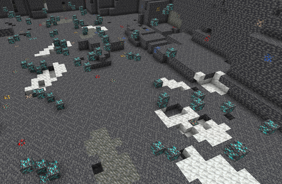
*A partially dug out diamond vein, taken from civwiki*

**Fossils**:
While mining you will see fossils (which look like prismarine shards) dropping to you, these are like small loot boxes that can be broken in the smelter for random rewards.

### [Realistic Biomes](./plugins/unique/rb)
You may have noticed your wheat farm isn’t growing even after several hours! Well there is a plugin called RealisticBiomes that prevents certain crops from growing based on the biome.  
You can check what crops can grow with the command **/rb**. Growth times are purposely several hours long, in order to produce enough players thus create massive farms.

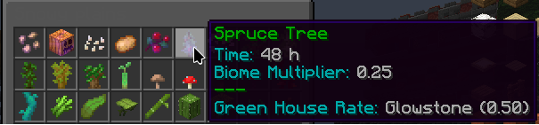
*Pictured: output of /rb in a snowy plains biome, it takes 48 hours to grow a spruce tree here !!*

**XP production and enchanting:**
One of the main reasons behind making crop growth times so long is due to XP (or levels). Villagers trading is disabled and the only way to enchant is via the enchanting table, which requires levels. 
Using a special factory called an **advanced cauldon**. Players can provide massive amounts of crops in return for emeralds, which can be right clicked to gain levels (like a bottle of enchanting).

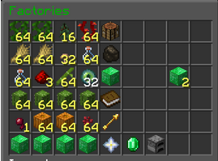
*Pictured: one of 4 xp factory recipes (yellow indicates a compressed item)*

## Nations and Getting started
Civmc is in its core a geopolitical server. Hundreds of people login everyday to write their own story. As a new player, it is widely recommended to first settle in an already established nation and learn the gripes of the plugins first. Mine a diamond vein and get max tools. Explore the world and learn about other nations. Beyond that the world's your oyster. 
If you are struggling to find a nation, you can browse a selection of them on the CivMC discord in the #Nation-Ads channel. Here nations explain what they're about and why you should join them. Check it out!

**One time Teleport:**
Every new player for the first 24 hours has the ability to teleport to another player anywhere on the server. It can be used only once and expires if unused.

To use your one time teleport, type the command **/ott to [playername]** and once the receiving player accepts your request, you will instantly teleport to the player.

*Credit to:*
Jaydon, DockerImage, ZeroQL and Specificlanguage for working on this guide.
