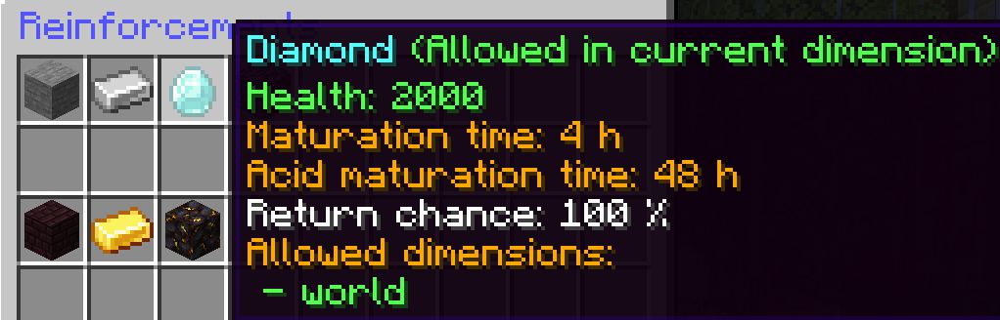
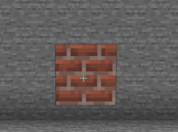
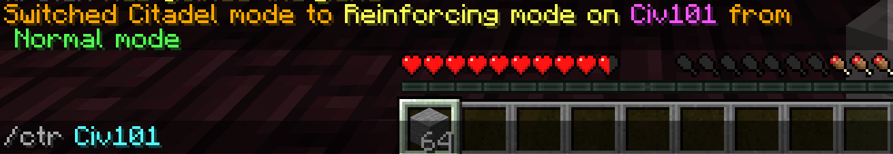
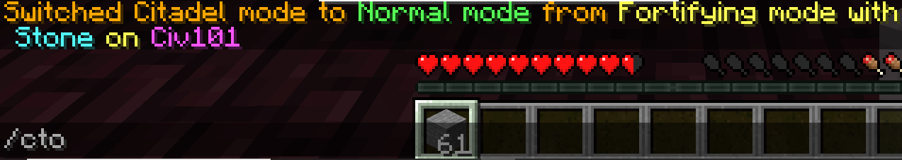

# Citadel
Citadel is another one of CivMC’s core features. Citadels allows players to reinforce blocks, lock chests and doors. It is not complete protection, anyone can still break your reinforcements with some effort depending on what is used to reinforce them. 

## Reinforcing

By running **/reinforcements** you can see that in the overworld, stone has a health of 50, iron 300 and diamond 2000

Health here equates to how many times a block has to be broken before it is dropped. This is why it is customary on the server to reinforce everything that you build. Because it takes resources to do so for each block, stone is most often used for this, while the others like iron and diamond are kept for chests or other important or valuable blocks.

To reinforce an already placed block hold one of the above mentioned items in your hand (stone, iron or diamond) and perform **/ctr** followed by a NameLayer group name.

Then punch the block you wish to reinforce to that group. This can also be done to change the reinforcement group of the block when it is already reinforced, given that you are on both groups and have a high enough permission level.

When particles appear around the block the reinforcement has been applied and the block has been protected. It is also possible to **reinforce while building** by performing **/ctf** instead of /ctr. Be mindful to keep enough stone in your inventory in this mode however, or else you'll exit the reinforcing mode and be building without adding protection.

Te **exit reinforcement mode** or any other type of citadel mode perform **/cto**, or repeat the original command.

### Maturation time

When a block is reinforced it takes time for the protection to mature, meaning that a reinforced block is not immediately at its maximum break amount. 
So, taking stone as an example, it would not immediately cost 50 breaks of a block to drop, but a much lower amount that scales with time. These values are also displayed in the **/reinforcements** window.

## Acid block

Sometimes you'd like to get rid of someone else's build, maybe it doesn't look all that great, or you'd like to make other use of the space. But woe be you! It's reinforced and you're not on the group. That's where acid blocks come in.

**Acid blocks are reinforced gold/diamond/netherite blocks** that after some time get rid of the reinforcement and break the block that they're near. Gold breaks the block above it. Diamond above and under. Netherite does so in every direction.

Each reinforcement type used requires an equivalent or greater type to be used for the acid block to work. Each acid block has a different maturation time depending on the material used.

#### Gold acid block maturation times:

Stone/Netherbrick: 2 hours.

Iron/Gold: 12 hours.

Diamond/Gilded blackstone: 24 hours.

#### Diamond acid block maturation times:

Stone/Netherbrick: 4 hours.

Iron/Gold: 24 hours.

Diamond/Gilded blackstone: 48 hours.

#### Netherite acid block maturation times:

Stone/Netherbrick: 8 hours.

Iron/Gold: 48 hours.

Diamond/Gilded blackstone: 96 hours.

Once the acid block has matured perform **/ctacid** while looking at the acid block. This breaks both the acid block and the blocks being acided. Multiple acid blocks can be broken at once.

## Bunkers

Bunkers are secure structures made with reinforced obsidian with the express purpose to keep people out who don't have permission to come inside. You can recognize them as big obsidian buildings, often with signs surrounding them telling you to keep out or else.

--Example of bunker--

Vaults are a much bigger variant of these bunkers, often stretching from bedrock to sky limit, that are most commonly used to store Exilepearls.

--Example of vault--

## Dropchests

The best way to keep raiders away from your goodies is a simple dropchest. To make one, dig down a couple dozen blocks, at least to stone level, and place a chest. Make sure to fill the hole back up and be sure you mark down the coordinates.

A mechanic called Orebfuscastion turns some blocks like chests to stone when far away from a player. This is to prevent cheaters with xray from finding hidden blocks. 
