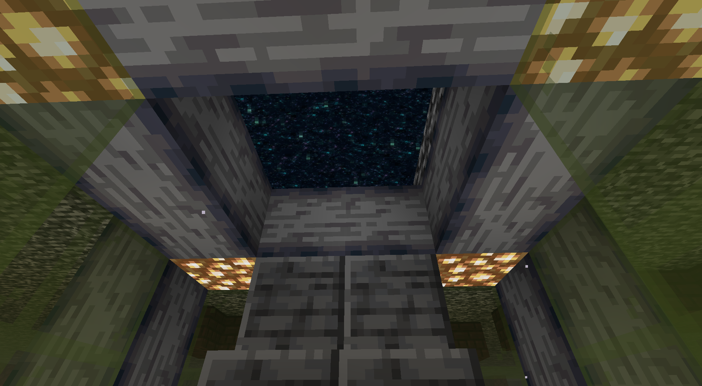

# ExilePearl
Whenever a player kills another player with an ender pearl in their hotbar the killed player will be banished to the nether, and will have no way to escape. This act of banishing is called "pearling". It is what allows players to enforce their own rules and facilitates high risk combat.

When pearled the player will spawn in the nether where they will have to live, until they are either released by their captor, have the pearl stolen and released by their allies or if the pearl is destroyed.

A player can broadcast the location of their pearl to a group by performing the command **/ep broadcast** followed by the group name.

A list of all pearled players can be viewed by performing the command **/ep showall.** 

## Essence

Pearls require player essence for fuel. If a pearl runs out of fuel the player it holds is released.

Fueling of pearls can be done by crafting them together with essence. Essence is gained daily by logging in and playing for ~30 minutes. 
This makes Essence a valuable resource for big nations, as it is also used in some crafting recipes, like that of XP production.

## Combat

Combat on Civ is tweaked to fit the server. For example, pre-1.8 style combat is enabled, but is limited to 9 clicks per second. A message will appear in chat to warn you when you cross this limit.
Throwing a pearl to teleport also has been given a cooldown of 15 seconds,
enchanted apples are disabled 
and ender crystals do not inflict damage to the player.

-picture of exceeding cps limit message-

## Nether travel

The nether cannot be accessed by vanilla obsidian portals. Instead there are end portals spread out over the world at bedrock.
Traversing these portals will spawn the player at the roof of the nether below another reversed end portal structure. These portals are also the only way out, besides dying.

