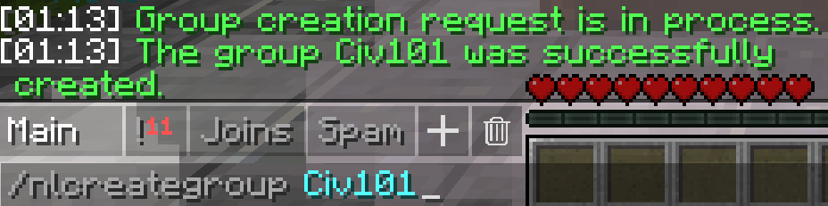
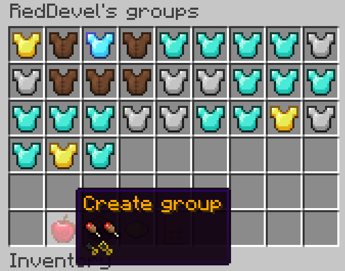
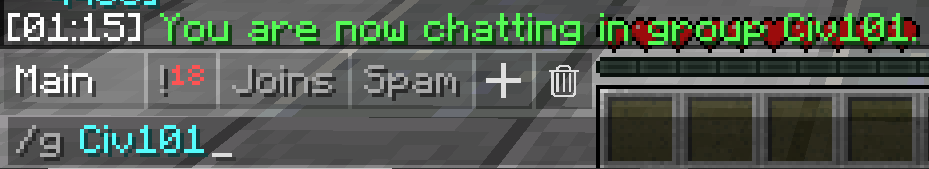
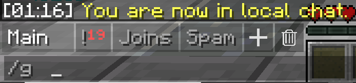
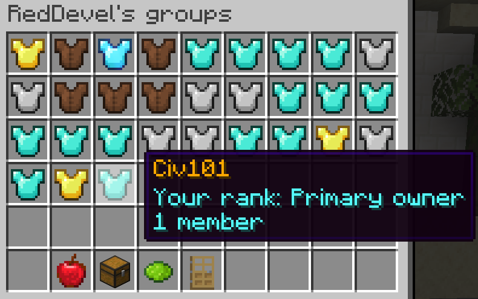
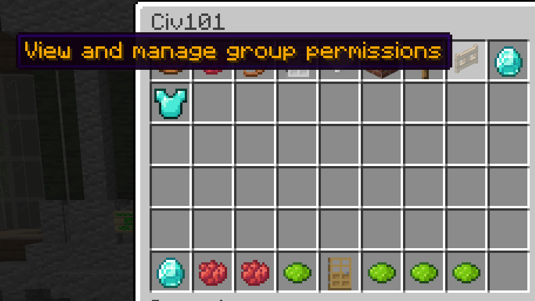
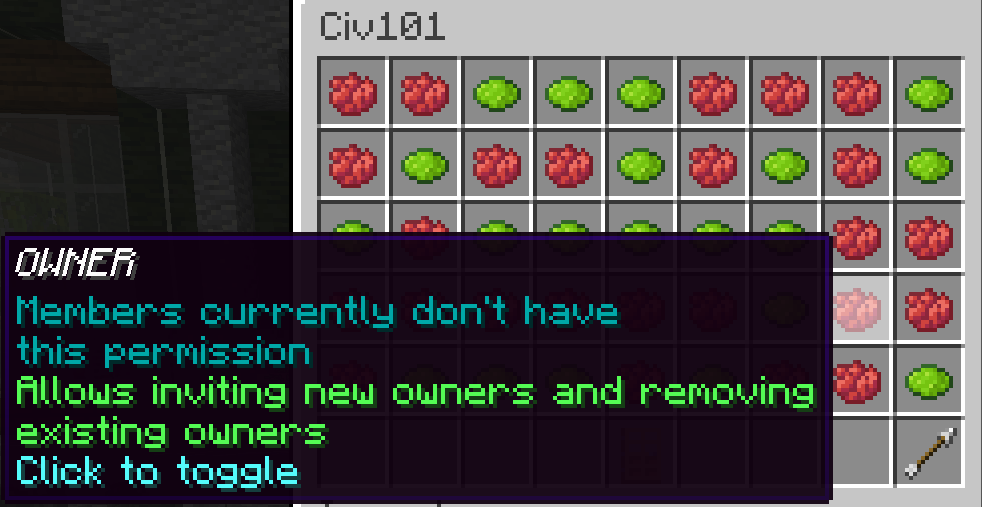

# Namelayer
NameLayer is one of CivMC’s core features. It allows you to make groups, which are then used by a variety of other plugins, such as Citadel.
One of the main features is the ability to talk with other members of the Namelayer group beyond the 1000 block local chat range.

## Making a group

To make a group simply perform the command **/nlcreategroup** (or /nlcg) and then the name for the group you’d like to make. 

This is also possible with the GUI which you can access by performing the command **/nl**

To start typing in a group use **/g** followed by the group name. 

Now only those in the group with the right permissions can see your messages. And if you’d like to return to local chat simply do **/g** on its own. 

## Changing group permissons

To edit permissions use the GUI by performing **/nl** then click on the group you’d like to change. 

Now on the fence gate top right. There are 5 different layers of permissions.

The first is for anyone not blacklisted, meaning that even people not on the group can use these permissions. 
From then on it’s member, mod, admin and owner. All have preset permissions on group creation, but each can be changed simply by clicking on them and changing it from green to red to disallow, or red to green to allow for that rank. 

