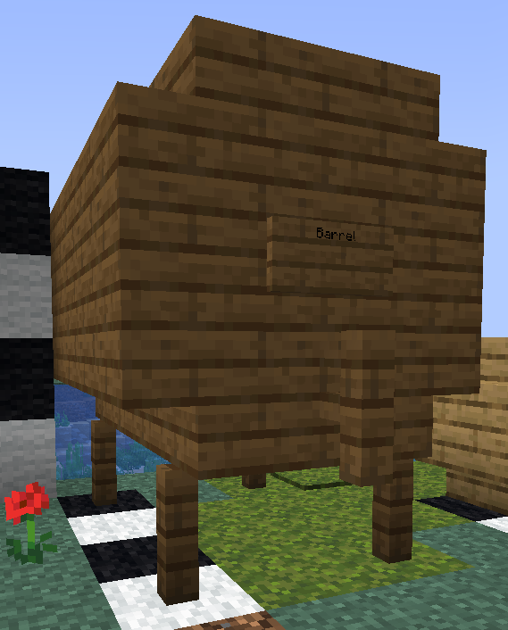

# Brewery
Brewery is a plugin that allows players to produce alcoholic drink, foods and even drugs that can have unique effects on the player who drinks them. The recipes to produce these drinks are not given out however, which means that players have to experiment with the ingredients and hints given below to find them, or get the recipes from those who have already. 

## Setting up
Setting up a brewery is very easy and only requires 3 separate things, all of which play a different part in the brewing process. These are as described below

### Cauldron
First up is the start of all brews. A Cauldron placed above fire, lava, a magma block or a campfire will allow you to use it for brewing, simply add some water to the cauldron and right click your ingredients in. You'll know the cooking process has started when the item disappears from your hand, and swirling potion particles come out of the cauldron.

You can right click a clock on the cauldron to see how long it has been cooking for in minutes. Use this to time your recipes. 

### Distilling
Second is a brewing stand, with the odd addition of placing 1 glowstone dust in the top slot, like so:

Brews taken out of the cauldron and put below the glowstone dust will be distilled. (The glowstone dust does not get used up) Every cycle of the downward arrow counts as 1 distill run. The brew will display how many times it has been distilled while hovering over it with you mouse. (1 distill run takes 40 seconds)

*Note that not all brews require you to distill them, this is an aspect you must experiment with. 

### Aging
Aging is done in barrels, these are simple multi block structures made out of wood, with a sign on them reading: "Barrel"

There are 2 versions. a small one which can hold and age 9 brews, and a large one which can hold and age a single chest's worth (27) see examples below: 

| Small Barrel | Large Barrel | Different kind of wood |
|:------------:|:------------:|:----------------------:|
|          |          |                    |

As seen the small barrel, is 2x2 made from wooden stairs, with the sign placed on the lower right corner.

The large one is 4x4 and consist of a total of: 20 planks and 16 stairs of the same type of wood, 1 fence post for the tap, and 1 sign in exactly the configuration shown. When correctly made a message in chat will notify the player that they have successfully made a barrel. The large barrel has two empty blocks in the center- you can put anything you like here (like snitches!) or leave it completely empty.

Knowing when and how long to age a brew for is found out by experimentation through trail and error. (1 year of aging is equal to 1 Minecraft day or 20 minutes real time)

*Note that barrels can be any type of wood, and that the wood type used can matter to the brew put inside to age. 

### Sealing
Don't forget this critical step if you're planning to sell your brews! Sealing your brews makes it so their recipe details are no longer displayed in its lore. So you're not giving out recipes for free! You can make a sealing station with 4 planks and 2 glass bottles in a crafting table. 

Just place it down, and put your finished brews in it;s crafting grid for a second or 2. The brew is sealed when there are [brackets] surrounding the stars in the lore. 

## Starter Brews
Below are some simple recipes to help you get started in your brewing career. Some may require custom ingredients you'll have to discover first however.

| Brew Name            |                        Cauldron   ingredients:Amount                        | Cauldron   Time | Distilling   Runs | Aging   Time | Wood   Type |
| -------------------- |:------------------------------------------------------------------------------:|:------------------:|:--------------------:|:---------------:|:--------------:|
| Tea                  |                                 Oak Leaves: 4                                  |       3 min        |          0           |        0        |       -        |
| Lemonade             |                         Citrus Juice: 3   Sugar: 8                          |       2 min        |          0           |        0        |       -        |
| Cider                |                                    Apple: 6                                    |       4 min        |          0           |     6 years     |      Any       |
| Red wine             |                                    Vine: 6                                     |       6 min        |          0           |     8 years     |      Any       |
| Champagne            |                    Glow berries: 12   Carbon Dioxide: 1                     |       10 min       |          0           |     4 years     |     Birch      |
| Wheatbeer            |                             Wheat: 12   Malt: 1                             |       4 min        |          0           |     2 years     |      Oak       |
| Vodka                |                            Potato: 13   Yeast: 1                            |       13 min       |        8 runs        |        0        |       -        |
| Irish Cream          |                  Wheat: 18   Milk Bucket: 1   Yeast: 1                   |       6 min        |        5 runs        |     4 years     |      Any       |
| Rice Porridge        |                              Rice: 1   Salt: 1                              |       15 min       |          0           |        0        |       -        |
| Vegetable Soup       |  Potato: 3   Carrot 3   Beetroot: 2   Salt: 1   Chicken Broth: 1   |       25 min       |          0           |        0        |       -        |
| Valentines Chocolate | Cocoa Beans: 3   Milk Bucket 3   Honey Bottle: 2   Vanilla Extract: 1 |       7 min        |          0           |        0        |       -         |

### Texture pack
Texture ID's are provided below with the list to be used while making a texture pack, allowing players to create a custom texture for each brew and ingredient. 

## Discovering new brews
### Vanilla ingredients
The Vanilla ingredients are items from the base game that can be used in the cauldron and are at least used by 1 recipe. And/or they are used to make a custom ingredient. Meaning that you can find almost all custom ingredients simply by seeing what the outcome is of all the possible vanilla items in the cauldron.

### Custom Ingredients
Custom ingredients are for the most part "Base brews" meaning that they are a result of putting 1 item in the cauldron, waiting 2 minutes or more and taking it out with a bottle.
A small amount of custom ingredients require specific amounts of an item, or require a combination of 2 vanilla items to be made.

### Intermediary results
When trying to discover new brews, something that will help you the most will be the intermediary results you find. These indicate that you've put in the correct collection of items for a brew, and that you should try distilling or aging the brew. Or that you need different amounts of the items you put in, to find the brew they indicate.

### Cauldron Particles
When trying to find the correct cooking time for a brew, the best way is to look at the color of the intermediary result. And wait until the particles above the cauldron turn that exact color. This requires you to watch carefully though, as the particles gradually change color over time.

### Trial and Error
Ultimately though, discovering new brewing recipes is a whole bunch of trial and error, trying out different combinations of ingredients, distilling, aging, wood types, and timings. A master brewer is a patient one.
To help you start out however, we have provided some information below of all brews in the game. 

## List of Discoverable Brews

### Basic Brews
The most simple form of brews, made with either base and/or custom ingredients. 

|          Name           | Ingredient Amount | Texture ID |
|:-----------------------:|:-----------------:|:----------:|
|        Wheatbeer        |         2         |   300001   |
|     The Simple Life     |         2         |   300002   |
|        Pale Ale         |         2         |   300003   |
|       Pale Lager        |         2         |   300004   |
|         Pilsner         |         2         |   300005   |
|          Cider          |         1         |   300006   |
|        Amber Ale        |         3         |   300007   |
|        White Ale        |         3         |   300008   |
|       Super Bock        |         2         |   300009   |
|       White Wine        |         1         |   300010   |
|        Red Wine         |         1         |   300011   |
|        Albarino         |         2         |   300012   |
|   Alvarinho Portugues   |         2         |   300013   |
|          Pinot          |         1         |   300014   |
|    Sauvignnon Blanc     |         1         |   300015   |
|         Chianti         |         2         |   300016   |
|        Cabernet         |         1         |   300017   |
|         Merlot          |         2         |   300018   |
|        Grenache         |         3         |   300019   |
|        Champagne        |         2         |   300020   |
|        Riesling         |         2         |   300021   |
|          Rose           |         2         |   300022   |
|         Whiskey         |         2         |   300023   |
|         Scotch          |         2         |   300024   |
|      White Whiskey      |         3         |   300025   |
|      Corn Whiskey       |         2         |   300026   |
|    Japanese Whiskey     |         3         |   300027   |
|          Sake           |         3         |   300028   |
|          Soju           |         3         |   300029   |
|          Vodka          |         2         |   300030   |
|       Wheat Vodka       |         3         |   300031   |
|     Melon Schnapps      |         3         |   300032   |
|       Irish Cream       |         3         |   300033   |
|          Kefir          |         2         |   300034   |
|        Kombucha         |         4         |   300035   |
|        Absinthe         |         3         |   300036   |
|        Applejack        |         2         |   300037   |
|          Basi           |         3         |   300038   |
|        Borovicka        |         1         |   300039   |
|         Brandy          |         1         |   300040   |
|         Cachaca         |         2         |   300041   |
|         Chicha          |         5         |   300042   |
|           Tea           |         1         |   300043   |
|        Black Tea        |         1         |   300044   |
|      Chamomile Tea      |         1         |   300045   |
|        Earl Grey        |         2         |   300046   |
|        Green Tea        |         1         |   300047   |
| A Matcha Made in Heaven |         2         |   300048   |
|        Mate Tea         |         1         |   300049   |
|       Redbush Tea       |         1         |   300050   |
|  English Breakfast Tea  |         4         |   300051   |
|          Milo           |         3         |   300052   |
|           Gin           |         3         |   300053   |
|       Pigeon Gin        |         4         |   300054   |
|          Mead           |         2         |   300055   |
|         Metaxa          |         1         |   300056   |
|           Rum           |         1         |   300057   |
|         Tequila         |         1         |   300058   |
|     Tomboy Tequila      |         2         |   300059   |
|        Amaretto         |         1         |   300060   |
|        Vermouth         |         5         |   300061   |
|    Dandelion Liquor     |         4         |   300062   |
| Sam Amogus Pale Pilsen  |         3         |   300063   |
|         Marzen          |         3         |   300064   |
|        Brown Ale        |         4         |   300065   |
|          Stout          |         5         |   300066   |
|       Dark Lager        |         4         |   300067   |
|       Chardonnay        |         3         |   300068   |
|       Celebration       |         2         |   300069   |
|     Bourbon Whiskey     |         3         |   300070   |
|      Bifrost Vodka      |         5         |   300071   |
|     Cherry Liqueur      |         1         |   300072   |
|        Ginjinha         |         3         |   300073   |
|     Orange Liqueur      |         1         |   300074   |
|      Sarsaparilla       |         3         |   300075   |
|       Ginger Beer       |         5         |   300076   |
|        Lemonade         |         2         |   300077   |
|        Coca Soda        |         4         |   300078   |
|        Leninade         |         3         |   300079   |
|       Limoncello        |         3         |   300080   |
|     Creme de menthe     |         3         |   300081   |
|     Chocolate Milk      |         3         |   300082   |
|      Energy Drink       |         2         |   300083   |
|        Espresso         |         1         |   300084   |
|        Americano        |         1         |   300085   |
|          Latte          |         2         |   300086   |
|          Mocha          |         4         |   300087   |
|        Iced Tea         |         2         |   300088   |
|       Iced Coffee       |         4         |   300089   |
|        Hot Coco         |         5         |   300090   |
|        Olive Oil        |         1         |   300091   |
|     Beetroot Vodka      |         2         |   300092   |
|     Melon Iced Tea      |         3         |   300093   |
|     Mango Schnapps      |         4         |   300094   |
|     Papaya Schnapps     |         4         |   300095   |
|   Vegetable Smoothie    |         3         |   300096   |
|   Pumpkin Spice Latte   |         8         |   300097   |
|  Chocolate Apple Cider  |         3         |   300098   |
|     Cannonball Rum      |         3         |   300099   |
|        Frog Grog        |         4         |   300100   |
|        Dr PVPer         |         4         |   300101   |
|       Cough Syrup       |         2         |   300102   |
|     The Gay Agenda      |         6         |   300103   |
|          Tonic          |         2         |   300104   |
|     Witch's Tongue      |         4         |   300105   |
|        Tombstone        |         4         |   300106   |
|       BloodWeiser       |         4         |   300107   |
|  De-Coffin-Ated Curse   |         3         |   300108   |
|         Phantom         |         4         |   300109   |
|         Eggnog          |         8         |   300110   |
|        Advocaat         |         5         |   300111   |
|       Love Potion       |         3         |   300112   |

### Food Brews
Brews that restore saturation

|         Name         | Ingredient Amount | Texture ID |
|:--------------------:|:-----------------:| ----------:|
|    Vegetable Soup    |         5         |     400001 |
|     Ratatouille      |         4         |     400002 |
|        Laksa         |         7         |     400003 |
|      Minestrone      |         7         |     400004 |
|         Pho          |        12         |     400005 |
| Chicken Noodle Soup  |        10         |     400006 |
|    Dumpling Soup     |         9         |     400007 |
|     Corn Chowder     |        11         |     400008 |
|       Goulash        |         7         |     400009 |
|    Tonkatsu Ramen    |         5         |     400010 |
|       Borscht        |         8         |     400011 |
|     Balti Gosht      |        12         |     400012 |
|    Rice Porridge     |         2         |     400013 |
|    Cranberry Pie     |         8         |     400014 |
|      Fish Soup       |         9         |     400015 |
|    Poached Salmon    |         6         |     400016 |
|       Marmite        |         3         |     400017 |
|    Mais con Hielo    |         4         |     400018 |
| Mediterranean Medly  |        11         |     400019 |
|   Halloween Candy    |         3         |     400020 |
|        Cheese        |         3         |     400021 |
|     Easter Bread     |         6         |     400022 |
|   Candied Carrots    |         5         |     400023 |
|      Dyed Eggs       |         2         |     400024 |
|     Deviled Eggs     |         6         |     400025 |
|     Carrot Cake      |         6         |     400026 |
| Valentines Chocolate |         4         |     400026 |

### Cocktail Brews
Brews made from other brews, sometimes with extra ingredients
|             Name              | Ingredient Amount | Texture ID |
|:-----------------------------:|:-----------------:|:----------:|
|            Martini            |         3         |   500001   |
|       Hunters Digestif        |         2         |   500002   |
|       Tropical Cocktail       |         3         |   500003   |
|          Raider Fuel          |         2         |   500004   |
|          Redcoat Rum          |         5         |   500005   |
|          Spicy Juice          |         2         |   500006   |
|            Zombie             |         2         |   500007   |
|     5 o' Block Somewhere      |         2         |   500008   |
|             Lean              |         2         |   500009   |
|          Bubble Tea           |         4         |   500010   |
|        Genderfluid Gin        |         3         |   500011   |
| Trans Rights Are Human Rights |         3         |   500012   |
|          Bees Knees           |         3         |   500013   |
|         Cherry Spritz         |         2         |   500014   |
|       Luck of the Irish       |         2         |   500015   |
|  Pan Galactic Gargle Blaster  |         5         |   500016   |

### Drug Brews
Brews that provide unique/useful effects

|     Name      | Ingredient Amount | Texture ID |
|:-------------:|:-----------------:|:----------:|
|    Cyanide    |         3         |   600001   |
|   Cannabis    |         1         |   600002   |
|     Meth      |         3         |   600003   |
|   Blue Meth   |         3         |   600004   |
|    Heroin     |         5         |   600005   |
|   Oestrogen   |         4         |   600006   |
|   Caffeine    |         5         |   600007   |
|  Ivermectin   |         3         |   600008   |
|      DMT      |         4         |   600009   |
|     Xanax     |         5         |   600010   |
|   Steroids    |         1         |   600011   |
| Testosterone  |         4         |   600012   |
|    Vicodin    |         5         |   600013   |
|    Yakult     |         6         |   600014   |
|    Cocaine    |         5         |   600015   |
|     Speed     |         4         |   600016   |
|     NAD+      |         6         |   600017   |
|  Epinephrine  |         5         |   600018   |
|   Firefoam    |         4         |   600019   |
| Nitroglycerin |         5         |   600020   |

### Nation Brews
Brews that are part of a nation or group's PR/culture and were submitted by them.

|    Nation/Group     |             Name              | Ingredient Amount | Texture ID |
|:-------------------:|:-----------------------------:|:-----------------:|:----------:|
|       Icenia        |       Icenian Pale Ale        |         4         |   700001   |
|       Dalgon        |          Dalgon Pale          |         3         |   700002   |
|        Pacem        |         Pacem Pilsner         |         3         |   700003   |
|         MTA         |        Augustan Cider         |         2         |   700004   |
|       Wolken        |       Wolken White Ale        |         5         |   700005   |
|     Southshire      |       Southshire Stout        |         6         |   700006   |
|         MTS         |   Septembrian Summer Breeze   |         2         |   700007   |
|    Commonwealth     |    Commonwealth Chardonnay    |         4         |   700008   |
|         CDM         |       Cortesian Chianti       |         3         |   700009   |
|        Sovia        |        Cabernet Sovian        |         2         |   700010   |
|      Lusitania      |         Lusitan Wine          |         3         |   700011   |
|       Fempire       |    Fempire Sparkling Rose     |         4         |   700012   |
|        Nara         |     Nara Pufferfish Wine      |         4         |   700013   |
|        CCTT         |       CCTT Pumpkin Wine       |         3         |   700014   |
|        Dirt         |           Dirt Wine           |         3         |   700015   |
|        Pavia        |         Pavian Wiskey         |         4         |   700016   |
|       Fempire       |          Fembourbon           |         4         |   700017   |
|       Griffin       |     Griffin Gold Whiskey      |         4         |   700018   |
|        Nara         |        Nara no Uisuki         |         4         |   700019   |
|      Gensokyo       |    Gensokyo no Ginjo Sake     |         3         |   700020   |
|        Venne        |          Venne Vodka          |         4         |   700021   |
|    Winterbourne     |   Winterbourne Wheat Vodka    |         4         |   700022   |
|       Estalia       |       Estalian Schnapps       |         5         |   700023   |
|     Southshire      |    Southshire Cream Liquer    |         5         |   700024   |
|         Ku          |            Kubucha            |         5         |   700025   |
|       Yoathl        |           Yoahpple            |         3         |   700026   |
|       Lambat        |           Lambasiat           |         4         |   700027   |
|       Yoathl        |       Chicha Alchuahtl        |         6         |   700028   |
|   Banana Republic   |     Banana Republic Mead      |         4         |   700029   |
|        Venne        |           Vennessy            |         3         |   700030   |
|        Mery         |       Smiles of T'shola       |         3         |   700031   |
|     Danzelonia      |        Dandedanzilonia        |         5         |   700032   |
|      Maseters       |         JaegerMaester         |         8         |   700033   |
|     Southshire      |    Shaken Southsire Sunset    |         4         |   700034   |
|        Pacem        |         Pacem Proper          |         4         |   700035   |
|        Venne        |       Venne Cream Soda        |         4         |   700036   |
|       Valyria       |      Valyrian Dragonwine      |         4         |   700037   |
|     Wheatistan      | Wheatistan Whimsical Whiskey  |         3         |   700038   |
|     Danzilonia      |       Danzilonian Wine        |         4         |   700039   |
|      Butternut      |   Butternut Pumpkin Bourbon   |         6         |   700040   |
|     New Phoenix     |   New Phoenix Fire Whiskey    |         3         |   700041   |
|     Pridelands      |        Pridelands Mead        |         3         |   700042   |
|       Acadia        |       Acadian Absinthe        |         4         |   700043   |
|       Icenia        |      Icenian Icebreaker       |         4         |   700044   |
|      Civmarket      |       CivMarket Chowder       |         6         |   700045   |
|   Margaritaville    |   Margaritaville Margarita    |         6         |   700046   |
|       Estalia       |         Vault Breaker         |         2         |   700047   |
|       Icarus        |         Nuclear Milk          |         4         |   700048   |
|       Amboise       |       Amboise Red Wine        |         3         |   700049   |
|        Atlas        |       Atlas Corp Cuban        |         4         |   700050   |
|        Eire         |         Irish whiskey         |         3         |   700051   |
|   Grand Imperium    |       Imperian Whiskey        |         3         |   700052   |
|       Warmia        |         Warmian Nitro         |         3         |   700053   |
|        Nara         |        Shiroyama Sake         |         4         |   700054   |
|   Grand Imperium    |              Ixi              |         2         |   700055   |
|   Grand Imperium    |     Imperian Carrot Juice     |         2         |   700056   |
|       Warmia        |         Angmar Vodka          |         3         |   700057   |
|        SPQR         |    Mint Chocolate Martini     |         4         |   700058   |
|       Reggio        |          Reggio Rum           |         5         |   700059   |
|      Gang Shi       |    The Shitter's Brown Ale    |         3         |   700060   |
|   Temporal Isles    |    Temporal Sweet Red Wine    |         4         |   700061   |
|      Attoprak       |         Secret Sprite         |         4         |   700062   |
|       Icarus        |         Boar Bourbon          |         3         |   700063   |
|        Joja         |           Joja Cola           |         4         |   700064   |
|      Brunsvilk      |       Brunsvilk Jenever       |         5         |   700065   |
|       Zanaris       | Zanarian Razzleberry Delight  |         5         |   700066   |
|       Zanaris       |         Faerie's Kiss         |         4         |   700067   |
|       XXXCIOS       |       Fruity Tooty Mix        |         4         |   700068   |
|     Bazariškės      |          Naminė Gira          |         4         |   700069   |
|       Griffin       |       Griffin Rose Wine       |         3         |   700070   |
|   Temporal Isles    |    Temporal Tropical Punch    |         4         |   700071   |
|    Transylvania     |         Cluj pálinka          |         3         |   700072   |
|       Griffin       |       Sealeo Rum Punch        |         3         |   700073   |
|        Spqr         |     Spicy Vodka Espresso      |         4         |   700074   |
|       Griffin       |      Griffin Melon Cider      |         2         |   700075   |
|       Reggio        |        Reggio Surprise        |         4         |   700076   |
|      Tortugain      |           Rosy Rum            |         3         |   700077   |
|      Bergburg       |         Bergburgbier          |         4         |   700078   |
|      Brunsvilk      |    Brunsvilk Sewage Water     |         5         |   700079   |
|        Iria         |      Irian Jungle Coffee      |         4         |   700080   |
|       Thoria        |         Thorian Cider         |         4         |   700081   |
|      Nro'meagh      |        Jevoghnya Brew         |         4         |   700082   |
|     Ila'Kyavul      |          Greek Fire           |         3         |   700083   |
|       Larauve       |     Larauve Medicinal Tea     |         4         |   700084   |
|        Bloom        |            Slushy             |         4         |   700085   |
|      Volterra       |         Tendie Tonic          |         4         |   700086   |
|      Volterra       |          Volt Vodka           |         3         |   700087   |
|        Aeros        |           Aeros Ale           |         3         |   700088   |
|       Cordoba       |          VB Longneck          |         3         |   700089   |
|       Yoathl        |         Gin of Rails          |         3         |   700090   |
|       Yoathl        |         Kobeerlinski          |         3         |   700091   |
|      Freeport       |      Frihavn Juniper Ale      |         4         |   700092   |
|      Freeport       |           Fen Fyool           |         5         |   700093   |
|       Midgar        |       Burning Blizzard        |         4         |   700094   |
|       Larauve       |      Larauve Bubble Tea       |         4         |   700095   |
|    Winterbourne     |   Winterbourne Lamb Knuckle   |         3         |   700096   |
|    Winterbourne     |           Winterale           |         3         |   700097   |
|    Winterbourne     |     Winterbourne Blue Ice     |         3         |   700098   |
|   Banana Republic   |  Banana Republic Pickleback   |         2         |   700099   |
|      Meracydia      |    Meracydian Mulled Cider    |         7         |   700100   |
|      Meracydia      |    Valar Winter Cheesecake    |         7         |   700101   |
|      Meracydia      |        Meracydian Mule        |         5         |   700102   |
|      Meracydia      |     Valar Steamfired Soda     |         6         |   700103   |
|       Larauve       |       Larauve Shortcut        |         5         |   700104   |
|        Vald         |           Vald Mead           |         4         |   700105   |
|       Estalia       |             Donut             |         5         |   700106   |
|        Gmall        |          Gmall Grog           |         4         |   700107   |
|      Doom City      |         Doom Delight          |         5         |   700108   |
|    Grebada State    |    Grenada Club White Rum     |         3         |   700109   |
|     New Jersey      |   Cranberry Juice Cocktail    |         4         |   700110   |
|      Hispania       |     Walloon Guard Whiskey     |         3         |   700111   |
|      Hispania       |      Line Infantry Lager      |         3         |   700112   |
|   Catholic Church   |       Sacramental Wine        |         2         |   700113   |
|         SEC         |  Security Enhancement Cider   |         3         |   700114   |
|     Greenfaith      |      Greenfaith Goulash       |         4         |   700115   |
|     Greenfaith      |      Trailblazer's Toddy      |         4         |   700116   |
|       Icaraki       |            Icaraki            |         2         |   700117   |
|     Truidencia      |        Nidaros Akevitt        |         2         |   700118   |
|     Truidencia      |           Warm Milk           |         2         |   700119   |
|      Amicitia       |        Amicitian Lager        |         4         |   700120   |
|       Kaowta        |      Kaowtanese Melonale      |         3         |   700121   |
|      ICE Labs       |         Cocaine Cola          |         6         |   700122   |
|        Bloom        |        Bloomin' Onion         |         1         |   700123   |
|        Baile        |         Azarath Mead          |         4         |   700124   |
|    CityOfEngland    |      Long Live The King!      |         4         |   700125   |
|     Khalkedonia     | Khalkedonian Crimson Cabernet |         4         |   700126   |
|      Snowpeak       |    Drunken Boxer’s Delight    |         2         |   700127   |
|       Artonia       |    Artonia Cherry slurpee     |         3         |   700128   |
|         CFA         |           Motor Oil           |         3         |   700129   |
|       Madeira       |   Madeirense Oceanic Rakija   |         4         |   700130   |
|        SPQR         |       Pine Grove Elixer       |         3         |   700131   |
|       Exyria        |             fent              |         3         |   700132   |
|     Khalkedonia     |             Ayran             |         4         |   700133   |
|       Eldoria       |      Eldorian Grand Wine      |         6         |   700134   |
|       Q'Barra       |       Q'Barran Hist Sap       |         5         |   700135   |
|       Q'Barra       |      Q'Barran Phlegmwine      |         4         |   700136   |
|      BEBO INC       |         Rust And Rot          |         2         |   700137   |
|      Alcantara      |          Spruce Raki          |         3         |   700138   |
|       Nalora        |       Minty Blue Juice        |         3         |   700139   |
|        Baile        |          Baile Deep           |         4         |   700140   |
|       Nalora        |           Blue Star           |         7         |   700141   |
|       Exyria        |        Piwo Tesc-mole         |         3         |   700142   |
|         IF          |    New Callisto Coppertop     |         4         |   700143   |
|       Mayguow       |      Erynorian Root Beer      |         3         |   700144   |
|        Soria        |      Sorian Hjemmebrent       |         4         |   700145   |
|         GWB         |    Groveheart Potato Wine     |         3         |   700146   |
|       Griffin       | Griffin Steak Co Liquid Lunch |         2         |   700147   |
|       Grenada       |     Grenada Club Dark Rum     |         3         |   700148   |
|       Salerno       |        Salerno Shandy         |         2         |   700149   |
|       Salerno       |      Brunsvik Bread Soup      |         7         |   700150   |
|     Khalkedonia     |           Shawarma            |        10         |   700151   |
|     Wellington      |   Wellington Cherry Liquor    |         4         |   700152   |
|         IF          |        Imperial Stout         |         5         |   700153   |
| Hello Kitty Islands |     Hello Kitty Hurricane     |         3         |   700154   |
|       Exyria        |        The White Raven        |         3         |   700155   |
|       Estalia       |     Suramirian Star Gazer     |         4         |   700156   |
|       Exyria        |             Melen             |         3         |   700157   |
|        Pavia        |        Bedfordian Mead        |         4         |   700158   |
|        Rivia        |      Syndicate's spirit       |         4         |   700159   |
|        Rivia        |        Worker's Stout         |         4         |   700160   |
|        Pavia        |         Banker's Dust         |         5         |   700161   |
|        Pavia        |      Wyepoint Moonshine       |         5         |   700162   |
|      Northfort      |      Northfortian vodka       |         2         |   700163   |
|      Northfort      |     Proletarian Strength      |         5         |   700164   |
|      BEBO Inc       |          Starch Cola          |         2         |   700165   |
|      Micronook      |        Mulled Melonade        |         3         |   700166   |
| Dr.Urzork Pharmancy |           Snake Oil           |         5         |   700167   |

### Player Brews
Brews specific to individuals either for their contribution to the genre/server
or by way of donating a high amount to the server via patreon.

|                Name                | Ingredient Amount | Texture ID |
|:----------------------------------:|:-----------------:|:----------:|
|           Lord Marzenpan           |         2         |   800001   |
|       SoundTech's Soundcheck       |         3         |   800002   |
|         WingZero's Wingman         |         3         |   800003   |
|       Ahri's Touhou Twister        |         3         |   800004   |
|      Maxoplopy's Beer Garden       |         3         |   800005   |
|      Diet_Cola's Rum and Cola      |         3         |   800006   |
|        Icekeeper's Icepick         |         3         |   800007   |
|    ProgrammerDan's Power Coffee    |         1         |   800008   |
|       TTK2's Closing Speech        |         3         |   800009   |
|       Infra's Code Injection       |         3         |   800010   |
|    Rourke750's Vermouth Reviver    |         3         |   800011   |
|    TealNerd's Sneaker Schnapps     |         3         |   800012   |
|       Eroc's Top of the Rock       |         4         |   800013   |
|      RedDevel's Devilish Wine      |         3         |   800014   |
|          Xfier's Firesnap          |         4         |   800015   |
|        Orinnari's Amaretto         |         3         |   800016   |
|     Awoo's Git reset Hard Head     |         3         |   800017   |
|     Gjum's Grape Juice on Ice      |         4         |   800018   |
|      NoTruePunkin Spiced Mead      |         4         |   800019   |
|     Kingtell's Royal Absinthe      |         5         |   800020   |
|        Gamer Gwua Bathwater        |         3         |   800021   |
|         Okx's Oxeye Oxkick         |         3         |   800022   |
|      Leo's Orange Creamsicle       |         6         |   800023   |
|       Colton's Love Martini        |         3         |   800024   |
|         Golden Pick Stout          |         4         |   800025   |
|            Astro's Pill            |         6         |   800027   |
| Jeremy's Slippy-Sloppy Screwdriver |         3         |   800028   |
|   Trizzzx's Worcestershire sauce   |         4         |   800029   |

    
## List of Custom Ingredients

|  #  |        Name        |      Texture ID      |
|:---:|:------------------:|:--------------------:|
|  1  |        Salt        |        100001        |
|  2  |    Black Pepper    |        100002        |
|  3  |        Malt        |        100003        |
|  4  |     Coriander      |        100004        |
|  5  |      Caramel       |        100005        |
|  6  |  Molten Chocolate  |        100006        |
|  7  |    Coffee Beans    |        100007        |
|  8  |  Vanilla Extract   |        100008        |
|  9  |    Chili Powder    |        100009        |
| 10  |    Citrus Juice    |        100010        |
| 11  |    Cherry Juice    |        100011        |
| 12  |      Walnuts       |        100012        |
| 13  |   Carbon Dioxide   |        100013        |
| 14  |       Yeast        |        100014        |
| 15  |        Koji        |        100015        |
| 16  |        Rice        |        100016        |
| 17  |     Hazelnuts      |        100017        |
| 18  |   Whipped Cream    |        100018        |
| 19  |      Wormwood      |        100019        |
| 20  |       Anise        |        100020        |
| 21  |       Fennel       |        100021        |
| 22  |  Sugarcane Juice   |        100022        |
| 23  |      Fish Oil      | 100023/100043/100044 |
| 24  |  Blueberry Juice   |        100024        |
| 25  |      Cinnamon      |        100025        |
| 26  |       Banana       |        100026        |
| 27  |       Thyme        |        100027        |
| 28  |      Almonds       |        100028        |
| 29  |    Green Olives    |        100029        |
| 30  |       Ginger       |        100030        |
| 31  |      Saffron       |        100031        |
| 32  |      Ginseng       |        100032        |
| 33  |    Mint Extract    |        100033        |
| 34  |    Mango Juice     |        100034        |
| 35  |     Plum Juice     |        100035        |
| 36  |    Papaya Juice    |        100036        |
| 37  |   Beetroot Juice   |        100037        |
| 38  |       Nutmeg       |        100038        |
| 39  |       Cloves       |        100039        |
| 40  |   Tapioca Balls    |        100040        |
| 41  |       Flour        |        100041        |
| 42  |       Onion        |        100042        |
| 43  |    Electricity     |        100045        |
| 44  |       Tomato       |        100046        |
| 45  |     Courgette      |        100047        |
| 46  |       Garlic       |        100048        |
| 47  |       Celery       |        100049        |
| 48  |      Noodles       |        100050        |
| 49  |   Chicken Broth    |        100051        |
| 50  |     Beef Broth     |        100052        |
| 51  |     Pork Broth     |        100053        |
| 52  |      Paprika       |        100054        |
| 53  |      Oregano       |        100055        |
| 54  |      Hydrogen      |        100056        |
| 55  |        Corn        |        100057        |
| 56  |     Pine Cone      |        100058        |
| 57  | Exotic Fruit Syrup |        100059        |
| 58  |       Acorn        |        100060        |
| 59  |      Quinine       |        100061        |
| 60  |     Mayonnaise     |        100062        |
| 61  |      Mustard       |        100063        |
| 62  |       Sulfur       |        100064        |
| 63  |       Helium       |        200001        |
| 64  |       Carbon       |        200002        |
| 65  |       Oxygen       |        200003        |
| 66  |      Nitrogen      |        200004        |
| 67  |     Phosphorus     |        200006        |
| 68  |      Chlorine      |        200007        |
| 69  |       Dough        |        200008        |
| 70  |       Butter       |        200009        |
| 71  |       Pomace       |        200010        |
    
## List of Vanilla Ingredients.

|  #  |                 Name                  |
|:---:|:-------------------------------------:|
|  1  |                 Sand                  |
|  2  |                 Coal                  |
|  3  |                 Wheat                 |
|  4  |            Beetroot Seeds             |
|  5  |                 Apple                 |
|  6  |                 Fern                  |
|  7  |              Oak Leaves               |
|  8  |                 Sugar                 |
|  9  |              Cocoa Beans              |
| 10  |              Melon Seeds              |
| 11  |              Blue Orchid              |
| 12  |               Redstone                |
| 13  |             Glow Berries              |
| 14  |                 Vine                  |
| 15  |               Raw Gold                |
| 16  |             Sweet Berries             |
| 17  |                 Bone                  |
| 18  |              Oak Button               |
| 19  |               Charcoal                |
| 20  |                Pumpkin                |
| 21  |                 Dirt                  |
| 22  |               Blue Ice                |
| 23  |               Snowball                |
| 24  |            Brown Mushroom             |
| 25  |              Cornflower               |
| 26  |             Red Mushroom              |
| 27  |               Seagrass                |
| 28  |                  Ice                  |
| 29  |                Potato                 |
| 30  |            Dark Oak Button            |
| 31  |              Milk Bucket              |
| 32  |            Dark Oak Leaves            |
| 33  |             Birch Leaves              |
| 34  |              Iron Nugget              |
| 35  |            Spruce Sapling             |
| 36  |              Azure Bluet              |
| 37  |              Tall Grass               |
| 38  |               Sugarcane               |
| 39  |                Oak Log                |
| 40  |                Salmon                 |
| 41  |                 Peony                 |
| 42  |               Dead Bush               |
| 43  |              Oxeye Daisy              |
| 44  |             Acacia Leaves             |
| 45  |             Azalea Leaves             |
| 46  |             Honey Bottle              |
| 47  |             Jungle Leaves             |
| 48  |                Cactus                 |
| 49  |             Spruce Leaves             |
| 50  |             Acacia Button             |
| 51  |             Brich Sapling             |
| 52  |             Weeping Vines             |
| 53  |             Hanging Roots             |
| 54  |                Carrot                 |
| 55  |                 Poppy                 |
| 56  |                 Book                  |
| 57  |                 Grass                 |
| 58  |             Golden Apple              |
| 59  | Chorus Fruit (Currently Unobtainable) |
| 60  |              Melon Block              |
| 61  |               Beetroot                |
| 62  |             Pumpkin Seeds             |
| 63  |                 Stick                 |
| 64  |             Diamond Sword             |
| 65  |            Diamond Pickaxe            |
| 66  |               Slimeball               |
| 67  |               Gunpowder               |
| 68  |             Blaze Powder              |
| 69  |              Wheat Seeds              |
| 70  |                Allium                 |
| 71  |                  Cod                  |
| 72  |             Tropical Fish             |
| 73  |            Redstone Torch             |
| 74  |               Rose Bush               |
| 75  |             Big Dropleaf              |
| 76  |                 Lilac                 |
| 77  |                 Kelp                  |
| 78  |            Cooked Chicken             |
| 79  |              Cooked Beef              |
| 80  |            Cooked Porkchop            |
| 81  |              Raw Copper               |
| 82  |            Small Dripleaf             |
| 83  |             Leather Boots             |
| 84  |              Wither Rose              |
| 85  |               Black Dye               |
| 86  |               Pink Dye                |
| 87  |              Acacia Log               |
| 88  |             Warped Fungus             |
| 89  |            Crimson Fungus             |
| 90  |             Water Bucket              |
| 91  |              Spider Eye               |
| 92  |           Poisonous Potato            |
| 93  |            Horse Spawn Egg            |
| 94  |               White Dye               |
| 95  |            Light Blue Dye             |
| 96  |               Sunflower               |
| 97  |              Fire Charge              |
| 98  |               Andesite                |
| 99  |               Deepslate               |
| 100 |                Red Dye                |
| 101 |                  Egg                  |
| 102 |              Milk Bucket              |
| 103 |                 Bread                 |
| 104 |            Glowstone Dust             |
| 105 |              Magma Cream              |
| 106 |               Blue Dye                |
| 107 |               Green Dye               |
| 108 |              Pufferfish               |
| 109 |        Glistering Melon Slice         |
| 110 |              Melon Slice              |
| 111 |               Dandelion               |
| 112 |            Carved Pumpkin             |
| 113 |               Amethyst                |
| 114 |             Spruce Button             |
| 115 |              Orange Dye               |
| 116 |              Yellow Dye               |
| 117 |              Purple Dye               |
| 118 |                  Tnt                  |
| 119 |                 Brick                 |
| 120 |                 Paper                 |
| 121 |             Jungle Button             |
| 122 |                Bamboo                 |
| 123 |             Baked Potato              |
| 124 |              Nether Wart              |
| 125 |               Obsidian                |
| 126 |             Birch Button              |
| 127 |             Pig Spawn Egg             |
| 128 |        Flowering Azalea Leaves        |
| 129 |              Spruce Log               |
| 130 |           Dark Oak Sapling            |
| 131 |              Gold Nugget              |
| 132 |             Chicken (raw)             |
| 133 |              Jungle Log               |
| 134 |             Lightning Rod             |
| 135 |             Rotten Flesh              |
| 136 |                 Stone                 |
| 137 |                 Rail                  |
| 138 |                Mutton                 |
| 139 |              Sea Pickle               |
| 140 |                Cookie                 |
| 141 |             Crimson Roots             |
| 142 |             Gold Pickaxe              |
| 143 |             Golden Ingot              |
| 144 |                  Mud                  |
| 145 |            Mangrove Roots             |
| 146 |            Jungle Sapling             |
| 147 |              Moss Block               |
| 148 |             Copper Ingot              |
| 149 |            Crying Obsidian            |
| 150 |          Lily Of The Valley           |
| 151 |             Cherry Planks             |
| 152 |             Spore Blossom             |
| 153 |           Prismarine Shard            |
| 154 |             Cherry Leaves             |
