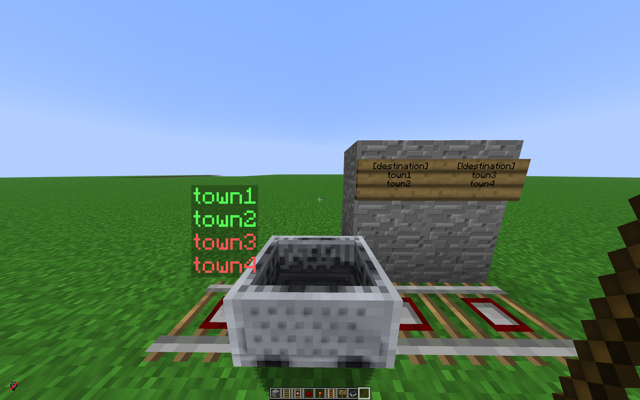
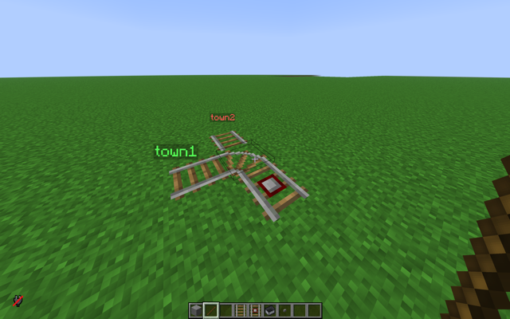
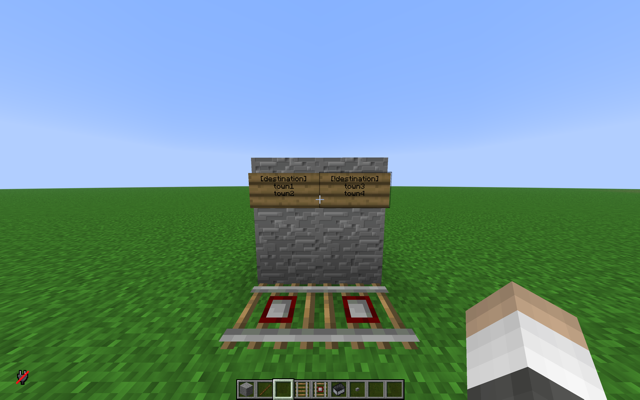

# Railswitch
RailSwitch automates detector-rail junctions so minecart riders can be routed by the destination they have set. Junctions can be configured either with legacy signs or with the new chat-driven editor, and optional overlays help builders visualise how the switch will behave.

## Quick start
- Place a detector rail at your junction and program it with the configuration tool (legacy signs remain available if you need backward compatibility).
- Players pick their destination with `/dest` (aliases `/destination`, `/switch`, `/setsw`) or via the RailSwitch menu in the player config GUI (/config).
- When a cart rolls across the detector rail, RailSwitch powers or disables the track based on the rider's destination list and the switch rules you set.
- Hold the configuration tool `stick` to see on-rail labels and, if enabled, predictive routing overlays.

## Setting your destination
Use `/dest <name>` to set one or more destinations, separated by spaces (e.g. `/dest capital spawn`). A wildcard `*` matches every switch. Clear your destination with `/dest` alone or by clicking **Clear Destination** inside `Player Config GUI (/config) -> RailSwitch`. The menu also exposes the **Visualization mode** toggle described below.

## Configuring switches with the tool
The modern editor stores switch data in the database, so you no longer need a sign once the rail is programmed.

1. Hold the configuration tool `stick`.
2. Right-click the detector rail. If it's reinforced, make sure you have Citadel permission so the session starts.
3. Open chat and enter one message with space-separated tokens:
   - `name` adds or re-enables a positive destination.
   - `!name` toggles a destination into the "never match" list (it takes priority over positives).
   - `-name` removes the destination entirely.
   - Prefix special names with `\` to escape the first character, e.g. `\-hub`.
   - Type `cancel` or `exit` to abort without saving.
4. You'll receive the updated list back. Sessions last 60 s and end early if you stop holding the tool or log out.

Switch data is saved immediately, survives restarts, and is cleaned up automatically if the detector rail breaks or pops off.

## Routing rules
- Positive destinations let the detector rail emit power. Negative (`!name`) destinations block power even if the player also matches a positive entry.
- Players can list several destinations in `/dest`; the first match wins. Prefixing a destination with `!` in your personal list acts as a personal blacklist, while `*` acts as a personal wildcard.
- Stored switches honour both positive and negative lists. Legacy sign switches rely on the first-line tag, so each sign can act as either a positive list (`[destination]`) or a negative list (`[!destination]`), not both at once.
- Each rail can store up to `10` entries by default. When that limit is reached extra tokens are rejected, so trim unused destinations before adding new ones.

## Visualisation & prediction
Holding the configuration tool within the configured range (default `10` blocks) shows floating labels sourced from switch data. The player setting **Visualization mode** cycles through:

- `Prediction`: highlights the detector rail, labels each exit, and previews the powered curve when a neighbouring switch rail is detected.
- `Visuals`: shows rail labels without simulating the next turn.
- `Disabled`: hides all overlays.

## Legacy sign switches (optional)
Sign-based switches remain for existing setups or simple fallbacks, but new builds should prefer the configuration tool.

- Place a sign on the block directly above the detector rail. The first line decides the behaviour: `[destination]` for normal routing, `[!destination]` for inverted routing.
- Each sign controls exactly one detector rail; signs cannot share destinations across multiple rails. The newer system’s !name syntax does not apply here — only the [!destination] or [destination] tag on the first line determines whether the switch is inverted.
- Wildcard `*` on the sign matches any player destination. With `[!destination]`, players listed on the sign are blocked while everyone else activates the rail.
- If Citadel is present, the detector rail and sign must share the same reinforcement group or the switch is ignored.

