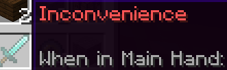
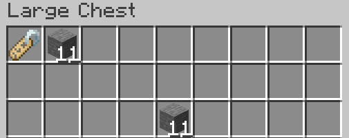
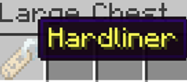

# Wordbank
Wordbank is a feature of the Research Station factory that names items with a random word / set of words with a color, all based on the input items. This allows players to discover, use and even trade any fun, cool or unique names they find. 

## Naming an item

To name an item using Wordbank, input the item you'd like to name into the **Research Station factory** at the top left spot of the chest. Any and all items elsewhere in the chest will be used as the identifier or "recipe" for the subsequent discovered word/word combination. It is important to note that the Research Station factory is unique in that it uses **emeralds (XP) as fuel** instead of charcoal, simply input emeralds into the top slot of the furnace to fuel the factory
Here's an example: 

|  |  |
|:--------:|:--------:|

As you can see above we input a name-tag in the top left corner of the chest, and place other items (this can be any combination of items, even items already named with wordbank) anywhere else inside. (stone in this example) Then running the factory will result in the other items being consumed and the first item being named. Make sure to remember the items used as input if you want to reproduce the result later! 
