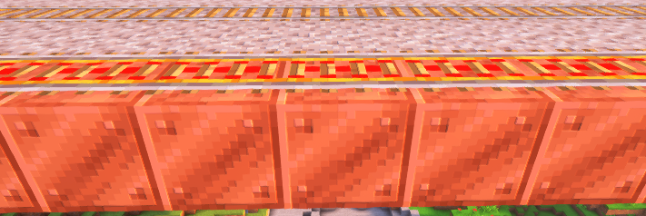
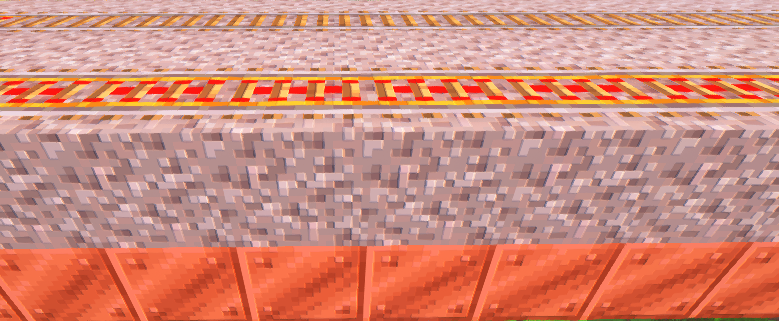
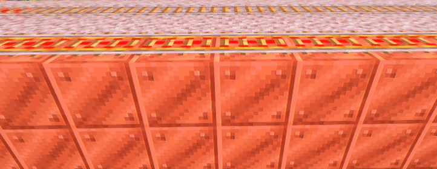
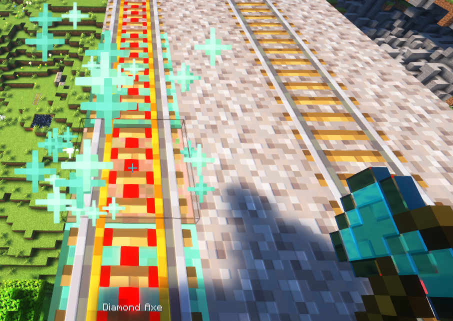
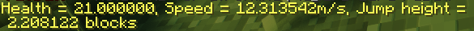

# Transport Changes
CivMC has made a couple changes to the speeds and mechanics of traveling across the world. Below these changes are explained:
1. Faster Rails and Copper Rails
2. Faster horses
3. Disabled elytras

## Copper Rails
On CivMC minecarts move faster than vanilla. And can be made even faster by putting **copper underneath the rails**, although everytime a minecart with a player travels over them they have a **small chance to oxidize**, decreasing the maximum speed.
Waxing the copper does not work to prevent this. Although the process of **deoxidation** has been made easier. Simply **right click the rail with an axe**, to revert the oxidation on the copper below. This will take durability off your axe like normal.

To incentivize building rails above ground, rails that have clear access to sky above them move slightly faster than those covered up with blocks or underground. 
Below is a chart that indicates the max speed both underground and above, for each of the copper oxidation levels and other blocks.

| Block            | Aboveground | Underground |
|:---------------- |:-----------:|:-----------:|
| Copper Block     |   30 m/s    |   29 m/s    |
| Exposed Copper   |   24 m/s    |   23 m/s    |
| Weathered Copper |   19 m/s    |   18 m/s    |
| Oxidized Copper  |   15 m/s    |   14 m/s    |
| Any other block  |   10 m/s    |    9 m/s    |
| Cobblestone      |    8 m/s    |    8 m/s    |

You should notice that putting **cobblestone** underneath a rail will revert the max speed back to vanilla. This is done so that players can slow down before more complex rail junctions, that rely on timings.
It is also advised to **slow down before going up**, else the minecart is likely to bounce back instead.

### Putting down copper

There's 3 different ways to put down copper (or cobblestone) underneath your rails. See these examples:

1. Directly under the rail

2. A block below the rail

3. Both!

Doing both is a bit overkill, but it is possible for those who want to maintain their rails less often, as both need to oxidize before speed slows down. And each has a separate chance to oxidize.

#### Maintaining rails. 

In most cases, copper under the rails has a 2% chance to oxidize a step whenever a minecart with a player inside ride overtop them, and is not subject to natural oxidation. However, for copper blocks to oxidise to exposed copper, the chance is 1.5%.
To remove oxidation right click the rail with any axe, particles with appear with each step when succesful like so: 

### Extra Notes
The copper itself does not speed up your minecart. You will need extra powered rails to bring it up to and maintain its speed!

Speed of the minecart is averaged out, this is to prevent sudden changes in velocity. And also means a slightly oxidized rail is not slowed down much.
This also means you might want a bit of a run up to your rails where you slow down the minecart. either for turns or for junctions. About 5 blocks should do. 

## Faster Horses
Horses have had their max speed increased!
from vanilla's 14.23 m/s to 18.5 m/s

To help with breeding horses you can also check their stats by right clicking a horse with a compass. this will display their Health, Speed and jump height like so:

## Disabled elytras
Elytras as of this moment have been disabled completely.
