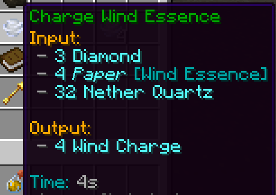

# Bleeze
The bleeze is a flying mini-boss that can be found in hot, arid environments, such as deserts or savanna. It is no easy fight! Be sure to bring potions!

The bleeze will summon breezes which drop wind essence and breeze rods. The wind essence can be used in a **Kinetics Factory** to craft wind charges.

Wind charges have a cooldown of 3 seconds compared to half a second in vanilla

Each bleeze also has a guaranteed heavy core drop. Bleezes will never spawn in the rain and will leave this world if it ever starts raining!

# Mace

Maces can be crafted with one breeze rod and one wind charge, or more efficiently in the Kinetics Factory. Their damage is capped at approximately 9 blocks of fall height (5.5 hearts vs full netherite with strength 2)

Maces deal 2x damage to armour, and have a 60-second cooldown.
