# Heliodor
The Heliodor plugin adds a new branch to the tech tree through a high cost resource called meteoric iron. This material is only found in small veins just underneath the surface, and only near portals. 
The process to find these veins is unique, in that you require a prerequisite material, heliodor gems. These gems are made through their own process that is explained below.
## Heliodor Gems
The main purpose of heliodor gems is to create the tool that allows you to find the meteoric iron veins, the Heliodor pickaxe. Below is a step by step guide to create a Heliodor pickaxe.
### Creating Heliodor Gems
1. The creation process starts in the gem factory. To create a gem factory you need the following resources:
    - 256 Player Essence
    - 256 Gold Blocks
    - 512 Lapis Blocks
    - 256 Emerald Blocks
2. After making the gem factory select and run the "Facet heliodor gem" recipe. This recipe requires the following resources:
    - 32 Player Essence
    - 128 Gold blocks
    - 128 Emerald blocks
    - 256 Lapis blocks

3. This creates 128 rough Heliodor gems (0% infused). To infuse the rough gems you will need to place them above a cauldron with lava. This starts a 1 minute and 40 second process indicated with lava particle effects that turn the gems from gold blocks to emerald blocks. The lava will be consumed in the process. Break the emerald blocks, and you will have rough heliodor gems (5% infused) Repeat the cycle again and you will have rough Heliodor gems (10% infused)

4. After every 2 cycles the rough gems reach max infusion. This means you need to go back to the gem factory, input your partially infused rough heliodor gems and run the "Refill Heliodor gems" recipe. This recipe requires the following resources:
    - 32 player Essence
    - 128 Emerald blocks
    - 128 rough heliodor gems (at max infusion)
5. Repeat steps 3 & 4 until you have 100% infused rough Heliodor gems. Put these fully infused gems back into the gem factory and run the "Polish Heliodor gem" recipe.
for every 8 rough Heliodor gems, 1 shears and 1 brush you gain 1 Heliodor gem.

### Heliodor pickaxe
Once you have your gems you can create the Heliodor pickaxe. Craft it with 3 gems and 2 sticks in the same pattern as a normal pickaxe. 
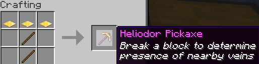

This pickaxe is crucial to finding the rare resource of Meteoric Iron. Only it has the ability to discover the Meteoric Iron veins around you when you use it to dig.
Don't be too carefree using it though, as it cannot be repaired. 
Once a vein has been mined out more than 50% of its total ores, the heliodor pickaxe stop detecting the vein and no longer displays a chat message when mining around it.

## Meteoric Iron
Meteoric Iron is a resource with unique magical properties. From armor to weapons, tools and some other things, it's a most useful resource to have. But very hard to come by.

### Meteoric veins
Every day 1 Meteoric Iron vein spawns in the world randomly around any of the portals. This spawning will keep happening up to when a maximum of 19 undiscovered veins exist. A vein counts as discovered when atleast one of the ores in that vein has been revealed.

Veins only spawn nearby portals, multiple veins may spawn near the same portal. Veins will only spawn if there are sufficient stone blocks for the ores to spawn in. As the the vein is mined out, the chance of ore spawning increases until it reaches 100%, guaranteeing that all ores will always spawn. 
Meteoric Iron veins are always contained in a 5 block radius, close to the surface in the stone layer.

Meteoric Iron deposits in the vein are predetermined, unlike with HiddenOre veins. This means that each vein has a fixed amount of ores decided at the moment of its spawning, an amount that is unaffected by block placement or anything else. 

#### Locating a vein
To locate a Meteoric Iron vein you must venture to any of the portals dotted around the map. (Tip! Consult the playermade map to find them) Around these portals Meteoric Iron Veins are able to spawn. 
Using the Heliodor pickaxe mine a stone or stone adjacent block, such as andesite. This will send you a message in chat, telling you whether there is a vein nearby or not. 

Hovering over these chat messages will display a tooltip explaining more closely what they mean.

Because the area scanned to find a vein when using the heliodor pickaxe is a sphere of 75 blocks, it is best to search in a hexagonal pattern around the portals. This maximises the search area with each block broken, saving you precious durability on the pickaxe. 

#### Mining a vein
One you have located a vein, when your pickaxe indicates high traces of Meteoric Iron. Dig around in the area with any other pickaxe to excavate it. Your first ore will tell you where to focus, as the radius of these veins is only 5.  
The ores are not affected by either silk touch or fortune, and will only ever drop 1 Meteoric Iron nugget per ore. 
The fewer stone blocks there are in the Vein radius, the higher the chance there is to spawn an ore; you can be certain pretty quick when a vein is depleted.

Take your nugget and turn them into ingots either in a normal crafting table in a 3x3 pattern like so. 
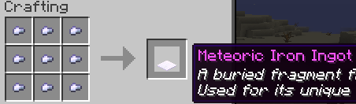
If you've already gathered a few, make yourself an Elite Ore Smelter Factory, for a better rate at 5.5 nuggets to 1 ingot. To make an Elite Ore Smelter factory, upgrade the Advanced Ore Smelter factory with the following resources:
- 16 Meteoric Iron ingots
- 64 Emerald blocks
- 96 Player essence
- 128 Diamonds
 
The Elite smelter factory also give increased rates for other ores. You can find these rates by looking in the **/fm** GUI

### Uses for Meteoric Iron
Meteoric Iron ingots can be crafted into a variety of things. from armor, weapons and tools with special effects. To factory upgrades to speed them up or decrease fuel usage, or backpacks that allow you to carry more items.

#### Meteoric Armor
Meteoric Iron armor can be crafted like other armor in the crafting table using the normal patterns. This armor comes pre-enchanted and cannot have enchanted books applied to them. See the images below to observe the enchants.
|                       Helmet                        |                      Chestplate                      |                       Leggings                       |                        Boots                         |
|:---------------------------------------------------:|:----------------------------------------------------:|:----------------------------------------------------:|:----------------------------------------------------:|
| 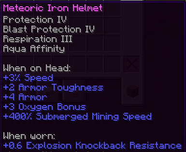              | 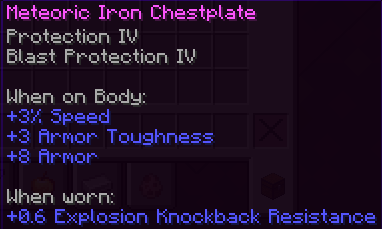       | 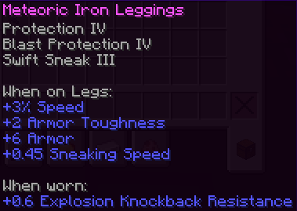           | 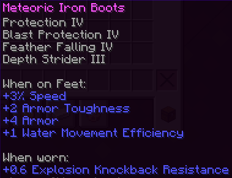                   |

Notable is the blast protection as well as normal protection. Swift sneak, an enchantment that's unable to be found otherwise is also present here on the leggings. 
Enchantments are not the only special thing about this armor. Each piece of armor grants the wearer a 3% movement bonus, for a total of 12% for a full set. This stacks with potion effects. 
A full set bonus is also present. Wearing all 4 pieces of Meteoric armor will make the wearer totally immune to fall damage. 

You might have noticed the lack of unbreaking on this armor, this is because the armor itself has a vastly increased durability pool. Below is a list of how much durability each piece has:
- Meteoric Iron Helmet: 6633 
- Meteoric Iron Chestplate: 9648
- Meteoric Iron Leggings: 9045
- Meteoric Iron Boots: 7839

Compare this to armor like netherite or diamond that average durability of around 500. Even with unbreaking 3 they still has vastly less durability that Meteoric Iron armor.
This is countered however by the fact that the armor cannot be repaired.

#### Meteoric Tools
There are 3 Meteoric Iron tools: the sword, the pickaxe and the axe. 
These also have vastly higher durability to their diamond/netherite counterpart, each having 48600 points of durability. And likewise also cannot be repaired.

##### Meteoric Iron Sword
- The Meteoric Iron Sword has 8 points of base damage. This is 1 less than netherite and 1 more than diamond swords. 
- Opponents hit by a meteoric iron sword have slowness 1 applied to them for 1 second. 
- Meteoric iron swords instantly break cobwebs.

##### Meteoric Iron Pickaxe
The Meteoric Iron Pickaxe can insta-mine all stone types, this includes deepslate. A formerly impossible

##### Meteoric Iron Axe
The meteoric Iron axe mimics a diamond axe mining speed except for the following blocks, these get broken in 2 ticks instead. (7 ticket with the server break delay.) 
The blocks below also take 2.5x reinforcement damage. Meaning that a stone reinforced chest needs to be broken 20 times instead of 50 to destroy the reinforcement. 
- Chest, trapped chest
- Fence gates
- Wooden pressure plates
- Logs
- Jukebox
- Barrel
- Wooden trapdoors
- Wooden fences
- Doors
- Planks
- Wooden slabs
- Wooden stairs
- Crafting table

The following blocks take 2x reinforcement damage when broken with the Meteoric Iron axe:
- Iron door
- Iron trapdoor
- Iron bars
- Copper trapdoor
- Copper door

##### Enchants
These tools also come pre-enchanted, observer below which enchantments each tool has:

|                        Sword                         |                       Pickaxe                        |                         Axe                          |
|:----------------------------------------------------:|:----------------------------------------------------:|:----------------------------------------------------:|
| 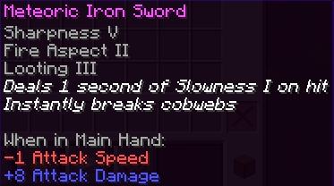         | 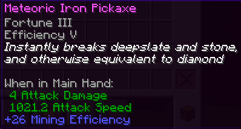     | 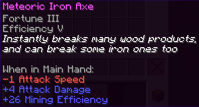             |

If instead of Fortune you'd prefer Silk touch on your Pickaxe/Axe you can add 2 amethyst shards into the crafting recipe. This will result in a silk touch version of the tool instead. Likewise with sword, you can craft it with amethyst crystals to apply knockback. See here the crafting recipe:

|                        Sword                        |                      Pickaxe                       |                        Axe                        |
|:---------------------------------------------------:|:--------------------------------------------------:|:-------------------------------------------------:|
| 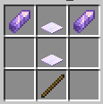        | 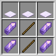     | 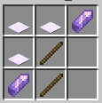        |

#### Meteoric Iron Factories
Like with Diamond and Netherite, a more efficient form of crafting the armor and tools is available through factories. By paying a large upfront cost, you can produce them at a large scale for around 40% fewer Meteoric Iron ingots. Here is a list of these Factories and their setup costs:

| **Meteoric Iron Helmet Smith** | **Meteoric Iron Chestplate Smith** | **Meteoric Iron Leggings Smith** | **Meteoric Iron Boots Smith** |
|:------------------------------:|:----------------------------------:|:--------------------------------:|:-----------------------------:|
|    Meteoric Iron Ingots: 21    |     - Meteoric Iron Ingots: 33     |    - Meteoric Iron Ingots: 30    |  - Meteoric Iron Ingots: 17   |
|      Player Essence: 126       |       - Player Essence: 196        |      - Player Essence: 168       |     - Player Essence: 98      |
|        Lapis Block: 144        |          Lapis Block: 224          |         Lapis Block: 192         |       Lapis Block: 112        |

| **Meteoric Iron Sword Smith** | **Meteoric Iron Pickaxe Smith** | **Meteoric Iron Axe Smith** |
|:-----------------------------:|:-------------------------------:|:---------------------------:|
|   - Meteoric Iron Ingots: 8   |   - Meteoric Iron Ingots: 12    | - Meteoric Iron Ingots: 11  |
|     - Player Essence: 49      |      - Player Essence: 77       |    - Player Essence: 70     |
|        Lapis Block: 56        |         Lapis Block: 88         |       Lapis Block: 80       |

#### Backpacks
Backpacks allow the player to access an extra inventory anywhere they want, accessible as long as they are able to interact with a backpack. This means you do not need to carry a backpack with you, just be able to access one where you need it. Allowing for communal access points, if nations a willing to risk it being stolen. 
These backpacks look like and function similar to vanilla enderchests, with the exception that once you die, all contents of the backpack will be dropped. Therefore, it cannot be used as an invulnerable storage place, like in vanilla. 

To craft a backpack surround an enderchest with Meteoric Iron ingots in a crafting table like so:
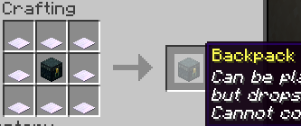

Backpacks have a few restrictions on what can be put inside them. Here is a list of what cannot be inserted:
- Unstackable items
- Ender pearls
- Backpacks or ender chests
- Golden apples
- Chorus fruit
- Obsidian, crying obsidian, or respawn anchors
- Ancient debris
- Netherite blocks
- Compacted items

#### Factory Upgrades
Factory upgrades can be used to speed up or lower the fuel cost of factories, saving you time and resources in the long run for an upfront investment.

Speed upgrades makes running recipes faster. This is especially useful on factories like compactors. Up to 4 upgrades of either can be added. 
To activate this upgrade, input your factory upgrade and run the "Upgrade speed" recipe in the lower right corner indicated by a soulfire torch
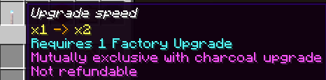

Consumption upgrades lower the fuel used in factories, This is primarily useful when running lots of recipes at once. Each upgrade up to 4 invested in this way decreases the fuel consumption of the factory. 
To activate this upgrade, input your factory upgrade and run the "Upgrade consumption" recipe in the lower right corner indicated by a redstone torch
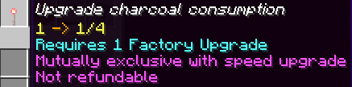

To craft the Factory Upgrade item you follow the recipe pattern below with Meteoric Iron on the sides in a normal crafting table:
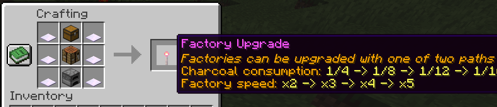
