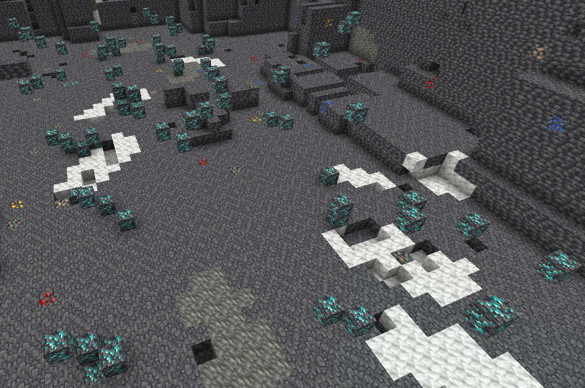

# HiddenOre
Every time a block that could contain ores is broken, there's a chance that ores will spawn around the player. Ores spawned this way depend on the Y level with spawn rates similar to vanilla ore distribution. Mining can be done at the same y-level for every ore like you'd do in vanilla Minecraft.

It is recommended to use silk touch when mining redstone, coal, diamond and lapis lazuli, to then smelt the ores using an ore smelter factory for better rates than fortune might give. Fortune should be used to mine copper, iron, and gold, then smelt it using an ore smelter factory.

## Veins

Ores can also spawn in veins. Veins can take many different shapes depending on the ore type.
A common strategy for mining out these veins is to mine a box around every found ore, stretching as much as 11 blocks from the center ore found.
Every time an ore is found a message will appear in chat notifying the player that they've discovered a new ore. It is common to use blocks or a waypoint mod to mark the ores to gain a sense of the shape of the vein to better be able to mine one out. 

Any ore can be found in a vein but **diamond ore only spawns in veins.** (Note: there were cave dusted diamonds at the start of the world, however, the majority of these have been mined out by players)

## Netherite Pickaxe Bonus

Netherite pickaxes provide a multiplier to ore spawn rate, and give diamond veins a chance to spawn multiple ores at once (up to triple), instead of only 1 per discovery as per normal for diamond tools and below. Making Netherite tools a worthwhile investment for any miner. 

## Fossils

While mining there's a chance a fossil might drop, these fossils can be broken in the **ore smelter factory** for a small chance at loot. The most common loot is either dirt, sand, or gravel.

#### Advanced Smelter Loot Table

| Probability  | Drop |
| ------------- | ------------- |
| 18.04%  | Dirt |
| 18.04%  | Cobblestone |
| 18.04% | Sand |
| 18.04% | Gravel |
| 18.04% | Terracotta |
| 0.09% , ~50 Possibilities | Player Head (Patrons, Notable Players, etc.) |
| 0.09%       | 1 Creeper Spawn Egg  |
| 0.09%       | 1 Zombie Spawn Egg         |
| 0.09%       | 1 Skeleton Spawn Egg       |
| 0.09%       | 1 Spider Spawn Egg         |
| 0.09%       | 1 Blaze Spawn Egg          |
| 0.09%       | 1 Ghast Spawn Egg          |
| 0.09%       | 1 Guardian Spawn Egg       |
| 0.09%       | 1 Magma Cube Spawn Egg     |
| 0.09%       | 1 Slime Spawn Egg          |
| 0.09%       | 1 Witch Spawn Egg          |
| 0.09%       | 1 Villager Spawn Egg       |
| 0.09%       | 1 Cave Spider Spawn Egg    |
| 0.09%       | 1 Enderman Spawn Egg       |
| 0.09%       | 1 Zombified Piglin Spawn Egg |
| 0.09%       | 1 Iron Pickaxe             |
| 0.09%       | 1 Iron Shovel              |
| 0.09%       | 1 Iron Axe                 |
| 0.09%       | 1 Iron Sword               |
| 0.09%       | 5 Note Block               |
| 0.09%       | 1 Diamond                  |
| 0.09%       | 1 Emerald                  |
| 0.09%       | 1 Iron Block               |
| 0.09%       | 1 Redstone Block           |
| 0.09%       | 1 Lapis Block              |
| 0.09%       | 1 Minecart                 |
| 0.09%       | 1 Mooshroom Spawn Egg      |
| 0.09%       | 1 Horse Spawn Egg          |
| 0.09%       | 1 Rabbit Spawn Egg         |
| 0.09%       | 1 Ocelot Spawn Egg         |
| 0.09%       | 1 Squid Spawn Egg          |
| 0.09%       | 1 Wolf Spawn Egg           |
| 0.09%       | 1 Axolotl Spawn Egg        |
| 0.09%       | 1 Bee Spawn Egg            |
| 0.09%       | 1 Panda Spawn Egg          |
| 0.09%       | 1 Dolphin Spawn Egg        |
| 0.09%       | 1 Stray Spawn Egg          |
| 0.09%       | 1 Strider Spawn Egg        |
| 0.09%       | 1 Hoglin Spawn Egg         |
| 0.09%       | 1 Cat Spawn Egg            |
| 0.09%       | 1 Fox Spawn Egg            |
| 0.09%       | 1 Iron Horse Armor         |
| 0.09%       | 1 Heart Of The Sea         |
| 0.09%       | 5 Prismarine Shard         |
| 0.09%       | 3 Prismarine Crystals      |
| 0.09%       | 1 Jukebox                  |
| 0.09%       | 1 Llama Spawn Egg          |
| 0.09%       | 1 Parrot Spawn Egg         |
| 0.09%       | 1 Polar Bear Spawn Egg     |
| 0.09%       | 1 Donkey Spawn Egg         |
| 0.09%       | 1 Skeleton Horse Spawn Egg |
| 0.09%       | 1 Zombie Horse Spawn Egg   |
| 0.09%       | 1 Endermite Spawn Egg      |
| 0.09%       | 1 Silverfish Spawn Egg     |
| 0.09%       | 1 Vex Spawn Egg            |
| 0.09%       | 1 Vindicator Spawn Egg     |
| 0.01%       | 1 Diamond Horse Armor      |
| 0.01%       | 1 Diamond Pickaxe          |
| 0.01%       | 1 Diamond Axe              |
| 0.01%       | 1 Diamond Shovel           |
| 0.01%       | 1 Sponge                   |
| 0.01%       | 1 Diamond Chestplate       |
| 0.01%       | 1 Diamond Leggings         |
| 0.01%       | 1 Diamond Helmet           |
| 0.01%       | 1 Diamond Boots            |
| 0.01%       | 64 Iron Ingot              |
| 0.01%       | 1 Diamond Block            |
| 0.01%       | 2048 Charcoal              |
| 0.01%       | 1 Bone Block               |
| 0.01%       | 1 Music Disc 13            |
| 0.01%       | 1 Music Disc Cat           |
| 0.01%       | 1 Music Disc Blocks        |
| 0.01%       | 1 Music Disc Chirp         |
| 0.01%       | 1 Music Disc Far           |
| 0.01%       | 1 Music Disc Mall          |
| 0.01%       | 1 Music Disc Mellohi       |
| 0.01%       | 1 Music Disc Stal          |
| 0.01%       | 1 Music Disc Strad         |
| 0.01%       | 1 Music Disc Ward          |
| 0.01%       | 1 Music Disc 11            |
| 0.01%       | 1 Music Disc Wait          |
| 0.01%       | 1 Music Disc Pigstep       |
| 0.01%       | 1 Music Disc Otherside     |
| 0.004%      | 1 Beacon                   |
| 0.004%      | 1 Enchanted Book           |
| 0.004%      | 1 Enchanted Book           |
| 0.004%      | 1 Enchanted Book           |
| 0.004%      | 1 Enchanted Book           |
| 0.004%      | 1 Enchanted Book           |
| 0.004%      | 1 Enchanted Book           |
| 0.004%      | 1 Enchanted Book           |
| 0.0004%     | 1 Paper                    |
| 0.0004%     | 1 Clock                    |
| 0.0004%     | 1 Apollo's Bow             | 
| 0.0004%     | 1 Imcando Pickaxe          |
| 0.00000001% | 1 Dragon Egg               |

