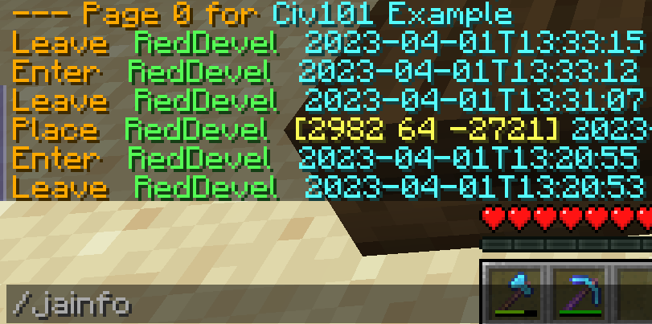

# JukeAlert
Reinforced note blocks and jukeboxes act like CCTV cameras for players. These blocks relay player actions in their 23x23 range. They're often referred to as "Snitches". Snitches are only accessible to players who are on the same NameLayer group as the snitch. 

## Note Blocks

A note block snitch only sends out a message when a player enters or joins the game inside its field. It does not record this information or store it. They're often used on borders of nations to be notified of passing through players or tracking down raiders.

Both the note block and jukebox snitch can be made by reinforcing them as with any other block, and will send their notifications to the group they are reinforced to. It is therefor handy to split them off from other groups, to control access for security reasons and prevent spam of your chat groups. It is also handy to name snitches themselves to know at a glance where they are located. This can be done by standing inside a snitches range and performing the command **/janame** followed by the new name. 

## Jukebox

Jukebox snitches function the same as noteblocks, with the added bonus that they log and store interactions such as block breaks, chest/door opening and player/animal kills. These logs can be accessed by any player with the right permissions on the snitch group by performing the command: **/jainfo** while standing near the snitch you'd like to view. **/ja** can also be used in the same way to access the logs in GUI form. 

To view a list of all snitches you have access to perform the command **/jalist**. You might notice that it tells you a **dormant time** underneath, this is the time it will take before the snitch stops working, to prevent this a person on the snitch reinforcement group needs to walk through the snitch field, this is commonly referred to as "refreshing the snitch". When instead of dormant it says **Cull time**, it mean that the snitch has gone dormant, if the snitch is not refreshed within this time the note block/jukebox will need to be broken and replaced for it to work again. 

## Discord integration

Snitches can be integrated with discord, to relay the snitch notifications to a discord channel. This way the notifications are logged and even viewable offline.

To do this you have to invite the Shakira bot to your discord server ([use this link](https://discord.com/oauth2/authorize?client_id=952325487663939645&scope=bot)) and give them access to a channel where you want the bot to relay the notifications to. Then perform the command: **!kira createrelayhere** followed by the snitch group name in the channel. 

