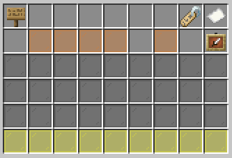

# PvP server
CivMC makes available to all players a seperate server, to practice its unique brand of PvP. Players can join the PvP server either via the IP: **pvp.civmc.net** 
Or by using the **/server pvp** command on the main server, be aware that this does leave a combatlogger!
Likewise to go back to the main server you can use **/server main** on the PvP server. Or jump through the lobby portal. 

## Arenas
Fighting is done in the many arenas available, from historic places throughout civ's history to the more simple maps, depending on what you prefer.
All arenas are dynamic, this means they can be altered in any way during your play session. Whether that is through explosions, building a bunker or flooding the map entirely.
Are you done with the map? Simply delete it and start a new one whenever you want!

### Creating Arenas
To create an arena first open the arena GUI with the **/Arena** Command. The differing items at the top are open arenas created by other players. Down at the bottom there are 2 paper items. Both create an arena, left creates a public one anyone can join. The right paper creates a private arena, where only players you invite can join.
Clicking on either will open a category menu, hovering over these items will show you which they are. Click on any one of them to see the arenas under that category.
Click on any one of these to create an arena of that map. Wait for a message in chat confirming the creation, then open the arena GUI again, and join your arena. 

### Managing Arenas
Public arenas can be joined at anytime by anyone, Just open the arena GUI with **/Arena** and click on any of the items on the top of the inventory. Hover over them to see a tooltip with details on who opened the arena, what map it is, and who's currently inside it.

If the arena is private you must be added to the whitelist by its creator. They can do this by running **/arena add (player)** You will then be able to join it like you would a public arena.
If the arena creator wants to kick someone out of his arena they can do this with the **/arena remove (player)** command. If that player is currently inside the arena they will be teleported back to the spawn lobby. 

## Kits
To fight you need equipment, this is easily done with kits. Open the kit GUI with the **/Kit** command. There are some preset kits you can equip right away by clicking on them. If these don't satisfy you can make your own!
You can also use **/kit load (kit name)** or **/kit load public (kit name)** if it's a public kit to equip it without going through the GUI. 

Use the **/clear** command to empty your inventory
### Creating Kits
To create a kit open the GUI with **/kit** and click on the paper item on the bottom of the GUI. This opens an anvil GUI where you can input the name of your new kit.
After choosing a name you will be met with this GUI:
|                   Kit creation GUI                   |
|:----------------------------------------------------:|
|              |

The Orange squares here represent your armor slots with the most right one being for your off hand, the gray your represents inventory and yellow your hotbar. 
Clicking on any of these squares will open another menu where you can pick items to equip in that slot. Whether it be armor, weapons, potions, blocks etc you have full range to test out what works best.
To enchant an item, first put it in one of the slots, then right click on it again to add an enchant, hover over the books to see which enchant they are. 
In this GUI you can also make the item unbreakable or change its durability with the icons on the bottom left. 

To edit one of your existing kits right click on it in the kit menu. To delete it shift right click on it instead and confirm. 

### Sharing Kits
To share one of your created kits, you need share with the other player the name of your kit. They can then utilize **/kit copy (Player) (Kit name) (New kit name)** This creates a copy of the specified player's kit under the name you've put in.

## Namelayer
While the PvP server does contain the namelayer plugin, it is not used during battles. The reason it's available is to connect your group messages from the main server to the PvP server! This allows you to still speak to anyone in your groups and even global chat!
This only updates every server restart however due to technical limitations. Any person added on the main server will have to wait a day before they can communicate in that group on the pvp server.
Because of this too, groups can not be altered or managed from the pvp server. You'll have to join the main server or use kira commands to do that instead.
