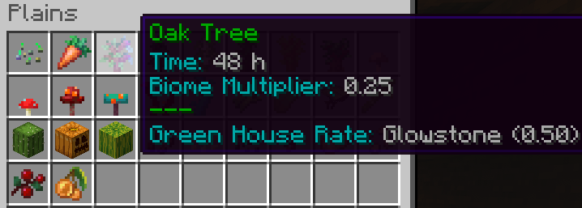
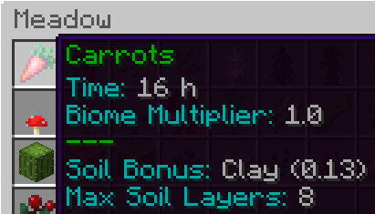

# Realistic Biomes
Realistic Biomes is a plugin that gives **each biome their own crops and trees with much longer grow times**, making farming a lot more in depth or "realistic". No more can you grow cocoa beans in the snow, or spruce trees in the desert. This is important for the economy of the server, making it so that no one person can grow it all on their small island, but instead forcing expansion or trade amongst nations and players. This also makes XP much harder to acquire on your own, forcing cooperation among players.

## Growing crops/trees

To see what crops and trees grow at your location, perform the command **/rb**. This will bring up a GUI like so: 

As you can see from the items with an enchanted glow, 3 things grow in the plains biome: wheat, carrots and oak trees. Hovering over any of these will tell you the time (in real hours) it takes to grow. This is based on a base time, and the biome multiplier. As we can see for this plains biome the multiplier is 0.25m, which means an oak tree will grow 4x as slow here as the base time of 12 hours. (Hence 48 hours)

## Greenhouse rate

The greenhouse rate displayed in the example above means that when **artificial light from glowstone** is used (instead of sun light) the time is further altered by this amount. So in this example, it will take 2x longer to grown oak trees, meaning 96 hours. This is a lot longer, but depending on the crop it may be worth it to stack up farms, saving horizontal space in exchange for longer growth times. 

## Clay soil bonus

A soil bonus will allow the crop to grow faster than normal. Simply putting layers of clay underneath the farmland, in this case (and most) a max of 8 layers of clay will speed up growth by a decent amount. This example of carrots with 16 hours growth time and 8 layers of clay added underneath would amount to a little below 8 hours. Which is over half of the original time, and so is very much worth it when needed in high quantities for production of XP. 

